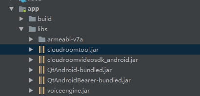

# 准备工作

## 帐号申请

[点此注册](https://sdk.cloudroom.com/mgr_sdk/register.html) 一个账号，或者联系商务代为开通，或在网站咨询客服。

<h2 id=getappid>创建项目</h2>


可以在 [管理平台](https://sdk.cloudroom.com/mgr_sdk/) 中创建新的项目（系统有一个默认项目，可以直接使用），如下图：


为了保障接口安全，后台不再显示App Secret，所以请在创建项目成功显示App Secret时妥善保存好。 如果遗忘只能如下图更换App Secret：


<h2 id=fireWallSettings>防火墙开通</h2>

在使用云屋SDK提供的相关服务之前，您需要打开下面这些特定的端口：

<table border=0 cellpadding=0 cellspacing=0 style='border-collapse:collapse;table-layout:fixed;'>
    <thead>
        <tr >
            <th style='width:12%;text-align:center'>端口</th>
            <th style='width:25%;text-align:center'>功能说明</th>
            <th style='width:23%;text-align:center'>Windows, Linux, Android, iOS, macOS, 网页插件</th>
            <th style='width:10%;text-align:center'>H5 SDK</th>
            <th style='width:10%;text-align:center'>小程序SDK</th>
            <th style='width:10%;text-align:center'>直播观看SDK</th>
            <th style='width:10%;text-align:center'>后台管理页面</th>
        </tr>
    </thead>
    <tbody>
    <tr>
        <td>TCP 2725</td>
        <td style='text-align:center'>后台管理服务端口</td>
        <td></td>
        <td></td>
        <td></td>
        <td></td>
        <td style='text-align:center'>√</td>
    </tr>
    <tr>
        <td>TCP 2726</td>
        <td style='text-align:center'>https服务端口<br />(SDK缺省使用https)
        </td>
        <td style='text-align:center'>√</td>
        <td style='text-align:center'>√</td>
        <td style='text-align:center'>√</td>
        <td style='text-align:center'>√</td>
        <td style='text-align:center'></td>
    </tr>
    <tr>
        <td>TCP 2728</td>
        <td style='text-align:center'>信令服务端口</td>
        <td style='text-align:center'>√</td>
        <td style='text-align:center'></td>
        <td style='text-align:center'></td>
        <td style='text-align:center'></td>
        <td style='text-align:center'></td>
    </tr>
    <tr>
        <td>TCP 1935</td>
        <td style='text-align:center'>服务器音视频流端口(rtmp)</td>
        <td></td>
        <td></td>
        <td style='text-align:center'>√</td>
        <td style='text-align:center'>√</td>
        <td style='text-align:center'></td>
    </tr>
    <tr>
        <td>UDP 2698</td>
        <td style='text-align:center'>服务器音视频流端口</td>
        <td style='text-align:center'>√</td>
        <td></td>
        <td></td>
        <td></td>
        <td></td>
    </tr>
    <tr>
        <td>UDP 2699</td>
        <td style='text-align:center'>服务器音视频流端口(H5)</td>
        <td></td>
        <td style='text-align:center'>√</td>
        <td></td>
        <td></td>
        <td></td>
    </tr>    
    </tbody>
</table>

<h2 id=beforeDev>开发环境准备</h2>

### 开发工具

<p style="width:100%;background:#f7f7f7;">推荐使用Android Studio或者Eclipse作为Android开发工具。</p>

### SDK下载

- [点此下载](https://sdk.cloudroom.com/pages/download#sdk) Android SDK

### SDK导入及集成注意事项

<font size="3" color="red">注意： 以Android Stuido作为集成SDK实例工具， 集成流程如下：</font>

1. 创建一个Android项目

2. 找到解压后的SDK根目录中，找到libs文件夹，将其拷贝到工程项目的app/libs目录中 ,如图所示：



在app目录下的build.gradle文件中android块中配置相关的sourceSets标签，如果没有使用该标签则新增,代码如下

``` java
 sourceSets {
        main {
            jniLibs.srcDirs = ['libs']
        }
    }
```

3. 添加权限声明到AndroidManifest.xml文件

``` xml
 <!-- 为了能使用OpenGLES 2.0 API，你必须在你的manifest中添加以下声明： -->
    <uses-feature android:glEsVersion="0x00020000" android:required="true" />
    <!-- 如果你的应用要使用纹理压缩功能，你必须还要声明设备需要支持什么样的压缩格式 -->
    <supports-gl-texture android:name="GL_OES_compressed_ETC1_RGB8_texture" />
    <supports-gl-texture android:name="GL_OES_compressed_paletted_texture" />

    <uses-permission android:name="android.permission.INTERNET" />
    <uses-permission android:name="android.permission.ACCESS_WIFI_STATE" />
    <uses-permission android:name="android.permission.WRITE_EXTERNAL_STORAGE" />
    <uses-permission android:name="android.permission.ACCESS_NETWORK_STATE" />
    <uses-permission android:name="android.permission.RECORD_AUDIO" />
    <uses-permission android:name="android.permission.RECORD_VIDEO" />
    <uses-permission android:name="android.permission.CAMERA" />
    <uses-permission android:name="android.permission.READ_PHONE_STATE" />
	<uses-permission android:name="android.permission.MODIFY_AUDIO_SETTINGS" />

``` 

4. 添加动态权限

开发环境中设置的compileSdkVersion高于23（Android6.0）时以上时，请注意添加相机，录音和内部存储空间的动态权限
</br>
	
```
Manifest.permission.CAMERA
Manifest.permission.RECORD_AUDIO
Manifest.permission.WRITE_EXTERNAL_STORAGE
Manifest.permission.READ_PHONE_STATE
```

+ 检查是否开启动态权限

```java
/**
 * 查看是否权限 返回值为true代表权限已经全部开启
 */
public boolean checkPermission(String... permissions) {
    //如果android版本低于Android6.0，默认为开启权限（无危险权限）
    if (Build.VERSION.SDK_INT < Build.VERSION_CODES.M) return true;

    PackageManager pm = contextWeakReference.get().getPackageManager();
    for(String permission : permissions) {
        if (PackageManager.PERMISSION_GRANTED !=
            pm.checkPermission(permission, contextWeakReference.get().getPackageName())) {
            return false;
        }
    }
    return true;
}
```

+ 添加缺省的动态权限

```java
/**
 * 获取需要申请权限的列表
 */
private List<String> findDeniedPermissions(String[] permissions) {
    List<String> needRequestPermissionList = new ArrayList<>();
    for (String perm : permissions) {
        if (ContextCompat.checkSelfPermission(contextWeakReference.get(), perm) != PackageManager.PERMISSION_GRANTED) {
            needRequestPermissionList.add(perm);
        } else {
            if (ActivityCompat.shouldShowRequestPermissionRationale(
                    activityWeakReference.get(), perm)) {
                needRequestPermissionList.add(perm);
            }
        }
    }
	
    return needRequestPermissionList;
}
```


5. 编写混淆文件，打开app目录下的proguard-rules.pro文件，添加如下代码。
``` properties

-keep class * { native <methods>; }
-keep class com.cloudroom.cloudroomvideosdk.** { *; }
-keep class com.cloudroom.cloudroomvideosdk.model.** { *; }
-keep class com.cloudroom.tool.** { *; }
-keep class com.cloudroom.screencapture.** { *; }
-keep class com.cloudroom.usbcamera.** { *; }
-keep class org.crmedia.** { *; }
-keep class org.crmedia.clearvoice.** { *; }
-keep class org.crmedia.crvedemo.** { *; }

``` 
