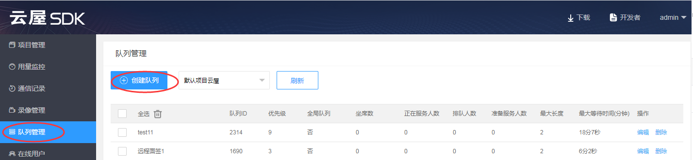

# 排队

## 功能简介

在呼叫中心的业务场景下，有多个客户呼叫进来，有多个坐席提供服务，简单的一对一呼叫无法满足业务需求。此时可以使用我们的排队功能，客户不再直接呼叫某个坐席，而是呼叫到一个坐席队列，由系统自动给客户分配一个空闲的坐席。
- 多个坐席可以服务于一个队列，客户排队这个队列时，系统会自动分配一个空闲坐席来提供服务。
- 一个坐席可以同时服务多个队列，优先服务高优先级队列里的客户，队列优先级相同时优先服务最早排队的客户。
- 业务高峰期没有空闲的坐席时，客户将在队列中排队等待，当有坐席空闲时，将为最早排队的客户提供服务。
- 同一队列的坐席可以配置不同的坐席优先级，队列中的客户优先由空闲的高优先级的坐席来提供服务。


:::danger

注意：在登录成功后才可以使用排队功能。

:::


<h2 id=createQueue>1.创建队列</h2>

可以通过两种方式创建队列：

- 第一种是[登录云屋SDK后台](https://sdk.cloudroom.com/mgr_sdk/login.html)并创建。如下图：
 

- 第二种是通过[Web API](http://sdk.cloudroom.com/sdkdoc/webapi)创建。


<h2 id=queue_get_data>2.初始化队列，获取队列数据</h2>

在登录成功后初始化队列数据

- 调用接口

```java
// 设置队列回调
CloudroomQueue.getInstance().registerCallback(mQueueCallback);
```

- 回调通知

```java
//可在登录成功后初始化队列数据
void onLoginSuccess() {
	// 初始化专家坐席用户队列
	CloudroomQueue.getInstance().initQueue("");
}

//队列初始化响应
void initQueueDatRslt(CRVIDEOSDK_ERR_DEF sdkErr, String cookie) {
	// TODO Auto-generated method stub
	ArrayList<QueueInfo> queueInfos = CloudroomQueue.getInstance().getAllQueueInfo();
}
```
相关API请参考:
+ [initQueue](API.md#initQueue)
+ [initQueueDatRslt](API.md#initQueueDatRslt)
+ [getAllQueueInfo](API.md#getAllQueueInfo)

相关结构定义请参考:
+ [VideoSessionInfo](TypeDefinitions.md#VideoSessionInfo)
+ [QueueInfo](TypeDefinitions.md#QueueInfo)

<h2 id=queue_operate>3.坐席队列操作</h2>

坐席角色开始和停止服务队列，以及操作后队列状态的变化

- 调用接口：

```java
//开始服务队列
CloudroomQueue.getInstance().startService(queID, "");
	
//停止服务队列
CloudroomQueue.getInstance().stopService(queID, "");
	
//获取服务的所有队列
ArrayList<Integer> queIDs = CloudroomQueue.getInstance().getServiceQueues();

```

- 回调通知：

```  java
//开始队列服务结果
@Override
void startServiceRslt(int queID, CRVIDEOSDK_ERR_DEF sdkErr, String cookie) {
    // TODO Auto-generated method stub
}
	
//停止队列服务结果
@Override
void stopServiceRslt(int queID, CRVIDEOSDK_ERR_DEF sdkErr, String cookie) {
	// TODO Auto-generated method stub
}
	
//队列状态变化通知
@Override
void queueStatusChanged(QueueStatus queStatus) { 
	// TODO Auto-generated method stub
}
```

相关API请参考：
+ [startService](API.md#startService)
+ [stopService](API.md#stopService)

相关结构定义请参考： 
+ [QueueStatus](TypeDefinitions.md#QueueStatus)

<h2 id=queue_request>4.坐席请求用户</h2>

在设置DND免打扰状下态，系统不再自动分配，需要手动申请用户

- 调用接口： 

```java
// 设置队列回调
CloudroomQueue.getInstance().registerCallback(mQueueCallback);
	
//设置免打扰状态，关掉系统自动推送
CloudroomVideoMgr.getInstance().setDNDStatus(1, "");
	
//手动请求一个用户
CloudroomQueue.getInstance().reqAssignUser("");
	
//取消免打扰，开启系统自动推送
CloudroomVideoMgr.getInstance().setDNDStatus(0, "");
```

- 回调通知: 

```java
//请求用户的结果
@Override
void reqAssignUserRslt(CRVIDEOSDK_ERR_DEF sdkErr, UserInfo usr, String cookie) {
	// TODO Auto-generated method stub
    if (sdkErr == CRVIDEOSDK_ERR_DEF.CRVIDEOSDK_NOERR){
        // 请求用户成功
    }else if(sdkErr == CRVIDEOSDK_ERR_DEF.CRVIDEOSDK_QUE_NOUSER){
        // 队列中没有排队人员
    }else{
        // 手动请求用户失败，代码：sdkErr
    }
}
```


相关API请参考:
+ [setDNDStatus](API.md#setDNDStatus)
+ [setDNDStatusSuccess](API.md#setDNDStatusSuccess)
+ [reqAssignUser](API.md#reqAssignUser)
+ [reqAssignUserRslt](API.md#reqAssignUserRslt)


<h2 id=queue_distribution>5.系统自动给坐席分配用户</h2>

系统自动分配的用户在坐席还未选择接受或拒绝时，系统可以撤回分配

+ 调用接口：

```java
// 设置队列回调
CloudroomQueue.getInstance().registerCallback(mQueueCallback);
```

+ 回调通知： 

```java
//系统自动分配用户通知
@Override
void autoAssignUser(UserInfo usr) {
    // TODO Auto-generated method stub
    //...
}

//接受或拒绝分配的用户操作响应
@Override
void responseAssignUserRslt(CRVIDEOSDK_ERR_DEF sdkErr, String cookie) {
    // TODO Auto-generated method stub
    //...
}

//系统撤回分配此用户通知
@Override
void cancelAssignUser(int queID, String usrID) {
    // TODO Auto-generated method stub
    //取消分配用户的弹框
}
```

相关API请参考: 
+ [autoAssignUser](API.md#autoAssignUser)
+ [responseAssignUserRslt](API.md#responseAssignUserRslt)
+ [cancelAssignUser](API.md#cancelAssignUser)

<h2 id=queue_custom>6.客户排队操作</h2>

客户选择一个队列进行排队，每次只能排一个队列

- 调用接口：
```java
//开始排队
int queID = 1;
CloudroomQueue.getInstance().startQueuing(queID, "");

//停止排队
CloudroomQueue.getInstance().stopQueuing("");
```

+ 回调通知：

```java
//开始排队结果
@Override
void startQueuingRslt(CRVIDEOSDK_ERR_DEF sdkErr, String cookie) {
    // TODO Auto-generated method stub
}

 //停止排队结果
@Override
void stopQueuingRslt(CRVIDEOSDK_ERR_DEF sdkErr, String cookie) {
    // TODO Auto-generated method stub
}

//队列状态变化通知
@Override
void queueStatusChanged(QueueStatus queStatus) {
     // TODO Auto-generated method stub
}

 //排队信息更新
@Override
void queuingInfoChanged(QueuingInfo queuingInfo) {
    // TODO Auto-generated method stub
}
```

相关API请参考:
+ [startQueuing](API.md#startQueuing)
+ [startQueuingRslt](API.md#startQueuingRslt)
+ [queueStatusChanged](API.md#queueStatusChanged)
+ [queuingInfoChanged](API.md#queuingInfoChanged)

相关结构定义请参考: 
+ [QueueStatus](TypeDefinitions.md#QueueStatus)
+ [QueuingInfo](TypeDefinitions.md#QueuingInfo)