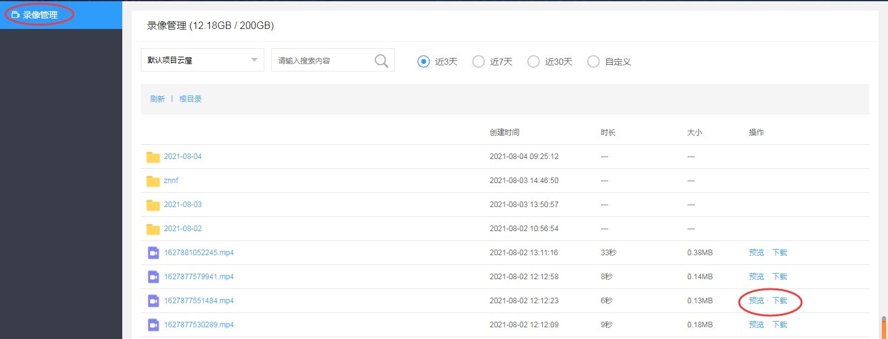

# 云端录制

## 功能介绍

在服务器上对房间内的音视频、影音共享、屏幕共享等通讯内容进行录制，支持自定义录制内容和布局，录制文件在服务器保存，可以通过[WEB API](https://sdk.cloudroom.com/sdkdoc/webapi/)下载和删除


<h2 id=startSvrMixer>1. 开始云端录制</h2>

录制文件时，可以根据业务需要，选择不同的录制布局。如下代码为创建左右布局的相关示例。

<p id=layout style="font-weight:normal;">左右布局示例图:  </p>


+ 混图器参数配置

```  java
//配置混图器编码参数：尺寸为640*360，帧率为15，其他采用默认设置
MixerCfg mixerCfg = new MixerCfg();
mixerCfg.frameRate = 15;
mixerCfg.dstResolution = new Size(640, 360);
```

+ 混图器内容配置 - 左右布局

```  java
//图像内容集合 - 创建左右布局的摄像头录制内容
ArrayList<MixerCotent> contents = new ArrayList<MixerCotent>();
//自己的摄像头（左边布局）, 设置摄像头录制视频大小，由于左右布局， 宽度只有录制布局的一半
Rect leftRect = new Rect(0, 0, mixerCfg.dstResolution.width/2, mixerCfg.dstResolution.height);
MixerCotent leftVideoItem = MixerCotent.createVideoContent(myUserID, (short)-1, leftRect);
//添加到内容列表
contents.add(leftVideoItem);
//其他人的摄像头（右边布局）
Rect rightRect = new Rect(mixerCfg.dstResolution.width/2, 0, mixerCfg.dstResolution.width, mixerCfg.dstResolution.height);
MixerCotent rightVideoItem = MixerCotent.createVideoContent(otherUserID, (short)-1, rightRect);
//添加到内容列表
contents.add(rightVideoItem);
```
+ 混图器输出配置

```  java
//配置混图器输出
ArrayList<MixerOutPutCfg> cfgs = new ArrayList<MixerOutPutCfg>();
MixerOutPutCfg outputCfg = new MixerOutPutCfg();
//设置混图输出类型为录像文件
outputCfg.type = MIXER_OUTPUT_TYPE.MIXOT_FILE; 
//录制文件路径为：/sdcard/_Android.mp4
outputCfg.fileName = "/sdcard/_Android.mp4";
cfgs.add(outputCfg);
```

+ 根据配置开启云端录制

```  java
HashMap<String, MixerCfg> mixerCfgs = new HashMap<String, MixerCfg>();
mixerCfgs.put("KEY_SVR_MIXERID", mixerCfg);

HashMap<String, ArrayList<MixerOutPutCfg>> mixerOutputCfgs = new HashMap<String, ArrayList<MixerOutPutCfg>>();
ArrayList<MixerOutPutCfg> outputCfgs = new ArrayList<MixerOutPutCfg>();
outputCfgs.add(outputCfg);
mixerOutputCfgs.put("KEY_SVR_MIXERID", outputCfgs);

HashMap<String, ArrayList<MixerCotent>> mixerContents = new HashMap<String, ArrayList<MixerCotent>>();
mixerContents.put("KEY_SVR_MIXERID", contents);

//开启云端录制
CRVIDEOSDK_ERR_DEF rst =  CloudroomVideoMeeting.getInstance().startSvrMixer(mixerCfgs, mixerContents, mixerOutputCfgs);
if(rst != CRVIDEOSDK_ERR_DEF.CRVIDEOSDK_NOERR)
{
  //开启云端录制出错!
  ...
}
```

- 回调通知：

```java
//云端录制状态变化通知
void svrMixerStateChanged(String operatorID, MIXER_STATE state, CRVIDEOSDK_ERR_DEF err)
{
  ...
}

```

相关API请参考:
+ [getDefaultVideo](API.md#getDefaultVideo)
+ [createVideoContent](TypeDefinitions.md#createVideoContent)
+ [startSvrMixer](API.md#startSvrMixer)
+ [stopSvrMixer](API.md#stopSvrMixer)
+ [svrMixerStateChanged](API.md#svrMixerStateChanged)

相关结构定义请参考：
+ [MixerCfg](TypeDefinitions.md#MixerCfg)
+ [MixerCotent](TypeDefinitions.md#MixerCotent)
+ [MixerOutPutCfg](TypeDefinitions.md#MixerOutPutCfg)
+ [CRVIDEOSDK_ERR_DEF](Constant.md#CRVIDEOSDK_ERR_DEF)


<h2 id=svrMixerOutputInfo>2. 云端录制文件信息变化通知</h2>

在此可获得录像文件的时长、大小、录像文件异常等信息

```  java
void svrMixerOutputInfo(MixerOutputInfo info){
    if ( info.state==MIXER_OUTPUT_STATE.OUTPUT_ERR ){
        //录像文件出错，info.errCode中有错误原因
    }
｝
```

相关API请参考:
+ [svrMixerOutputInfo](API.md#svrMixerOutputInfo)

<h2 id=updateSvrMixerContent>3. 更新云端录制内容</h2>

如下为创建画中画布局作为更新后的云端录制内容

<p id=layout style="font-weight:normal;">画中画布局示例图:  </p>


+ 混图器内容配置 - 画中画布局

```java
//更新为画中画模式
// 图像内容集合 - 创建画中画布局的摄像头录制内容， 
ArrayList<MixerCotent> contents = new ArrayList<MixerCotent>();

//自己的摄像头（充满布局）
Rect bigRect = new Rect(0, 0, mixerCfg.dstResolution.width, mixerCfg.dstResolution.height);
MixerCotent bigVideoItem = MixerCotent.createVideoContent(myUserID, (short)-1, bigRect);
// 添加到内容列表
contents.add(bigVideoItem);

//其他人的摄像头（部分布局）
Rect smallRect = new Rect(0, 0, mixerCfg.dstResolution.width/5, mixerCfg.dstResolution.height/5);
MixerCotent smallVideoItem = MixerCotent.createVideoContent(otherUserID, (short)-1, smallRect);
// 添加到内容列表
contents.add(smallVideoItem);
```

+ 更新混图器内容

```java		
HashMap<String, ArrayList<MixerCotent>> mixerContents = new HashMap<String, ArrayList<MixerCotent>>();
mixerContents.put("KEY_SVR_MIXERID", contents);

//更新录制内容
CloudroomVideoMeeting.getInstance().updateSvrMixerContent(mixerContents);
```
相关API请参考:
+ [updateSvrMixerContent](API.md#updateSvrMixerContent)


<h2 id=obtainStatue>4. 获取云端录制状态</h2>
</br>

``` java
//获取云端录制状态
MIXER_STATE state = CloudroomVideoMeeting.getInstance().getSvrMixerState()
```

相关API请参考:
+ [getSvrMixerState](API.md#getSvrMixerState)

相关结构定义请参考：
+ [MIXER_STATE](Constant.md#MIXER_STATE)


<h2 id=stopSvrMixer>5.停止云端录制</h2>

停止云端录制，也会触发事件[svrMixerStateChanged](API.md#svrMixerStateChanged)

- 接口调用：
```java
CloudroomVideoMeeting.getInstance().stopSvrMixer();
```

相关API请参考:
+ [stopSvrMixer](API.md#stopSvrMixer)
+ [svrMixerStateChanged](API.md#svrMixerStateChanged)


<h2 id=record_getFile> 6.获取录像</h2>

录像停止后，录像文件会开始上传到录像文件存储服务器中（可关注[notifyCloudMixerOutputInfoChanged](Apis.md#notifyCloudMixerOutputInfoChanged)通知，得到上传完成事件）。 

可以通过[WEB API](http://sdk.cloudroom.com/sdkdoc/webapi/)进行录像文件查询、下载和删除等处理。

也可以登录[管理后台](https://sdk.cloudroom.com/mgr_sdk/)，在管理页面上回放和下载录像：


