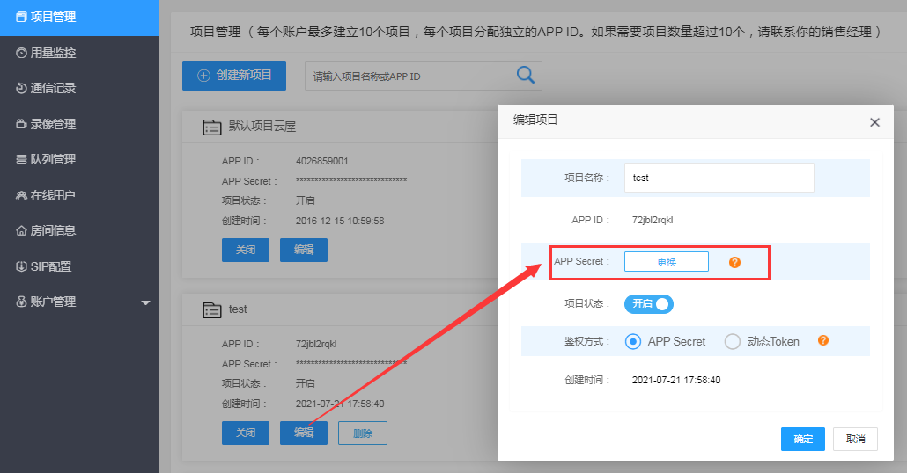
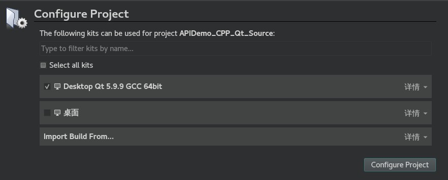
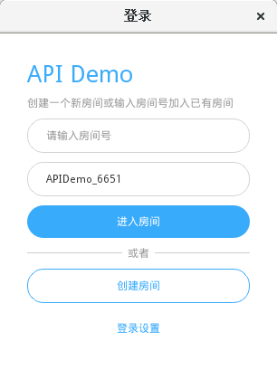
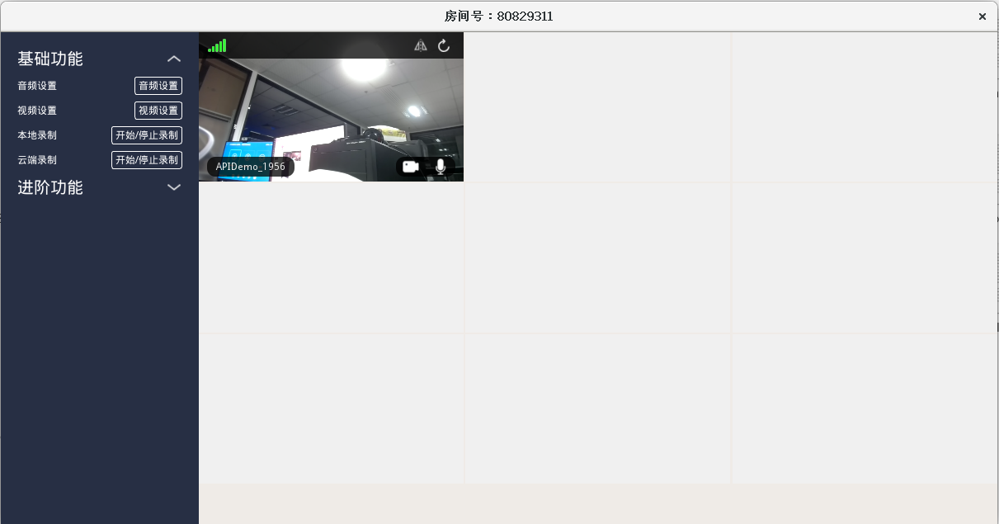

# 跑通示例项目

云屋在 GitHub 上提供开源的音视频通话示例项目。本文介绍如何快速跑通多人音视频通话的示例项目 [API-Demo](https://github.com/cloudroomSDK/API-Demo/tree/main/Linux)（基于 Qt），体验云屋音视频通话的基本/进阶功能。

## 帐号申请

[点此注册](https://sdk.cloudroom.com/mgr_sdk/register.html) 一个账号，或者联系商务代为开通，或在网站咨询客服。

<h2 id=getappid>创建项目</h2>

可以在 [管理平台](https://sdk.cloudroom.com/mgr_sdk/) 中创建新的项目（系统有一个默认项目，可以直接使用），如下图：

为了保障接口安全，后台不再显示App Secret，所以请在创建项目成功显示App Secret时妥善保存好。 如果遗忘只能如下图更换App Secret：

<h2 id=fireWallSettings>防火墙开通</h2>

在使用云屋SDK提供的相关服务之前，您需要打开下面这些特定的端口：

<table border=0 cellpadding=0 cellspacing=0 style='border-collapse:collapse;table-layout:fixed;'>
    <thead>
        <tr >
            <th style='width:12%;text-align:center'>端口</th>
            <th style='width:25%;text-align:center'>功能说明</th>
            <th style='width:23%;text-align:center'>Windows, Linux, Android, iOS, macOS, 网页插件</th>
            <th style='width:10%;text-align:center'>H5 SDK</th>
            <th style='width:10%;text-align:center'>小程序SDK</th>
            <th style='width:10%;text-align:center'>直播观看SDK</th>
            <th style='width:10%;text-align:center'>后台管理页面</th>
        </tr>
    </thead>
    <tbody>
    <tr>
        <td>TCP 2725</td>
        <td style='text-align:center'>后台管理服务端口</td>
        <td></td>
        <td></td>
        <td></td>
        <td></td>
        <td style='text-align:center'>√</td>
    </tr>
    <tr>
        <td>TCP 2726</td>
        <td style='text-align:center'>https服务端口 (SDK缺省使用https)
        </td>
        <td style='text-align:center'>√</td>
        <td style='text-align:center'>√</td>
        <td style='text-align:center'>√</td>
        <td style='text-align:center'>√</td>
        <td style='text-align:center'></td>
    </tr>
    <tr>
        <td>TCP 2728</td>
        <td style='text-align:center'>信令服务端口</td>
        <td style='text-align:center'>√</td>
        <td style='text-align:center'></td>
        <td style='text-align:center'></td>
        <td style='text-align:center'></td>
        <td style='text-align:center'></td>
    </tr>
    <tr>
        <td>TCP 1935</td>
        <td style='text-align:center'>直播观看端口</td>
        <td></td>
        <td></td>
        <td style='text-align:center'>√</td>
        <td style='text-align:center'>√</td>
        <td style='text-align:center'></td>
    </tr>
    <tr>
        <td>UDP 2698</td>
        <td style='text-align:center'>服务器音视频流端口</td>
        <td style='text-align:center'>√</td>
        <td></td>
        <td></td>
        <td></td>
        <td></td>
    </tr>
    <tr>
        <td>UDP 2699</td>
        <td style='text-align:center'>服务器音视频流端口(H5)</td>
        <td></td>
        <td style='text-align:center'>√</td>
        <td></td>
        <td></td>
        <td></td>
    </tr>    
    </tbody>
</table>

## 跑通基于Qt的示例项目

  

### 前提条件

操作系统：CentOS 7、Ubuntu 18等Linux（64位）操作系统
编译器：g++4.8.5 或以上版本、Qt 5.9.9
IDE：Qt Creator 4.11.0

### 集成SDK

1. 将 [API-Demo](https://github.com/cloudroomSDK/API-Demo/tree/main/Linux) 仓库拉取到本地。进入 API-Demo/CRVideoSDK 目录。

2. 访问 [SDK下载中心](https://sdk.cloudroom.com/pages/download#sdk) 将 Linux SDK 下载到本地，解压后将 include 目录和 lib 目录复制到 API-Demo/CRVideoSDK 目录下。

### 操作步骤

1. 在 API-Demo 目录下，用 Qt Creator 打开 APIDemo.pro 文件。在项目配置页面的开发环境选择中，选择 Desktop Qt 5.x.x GCC 64bit

2. 在 Qt Creator 左边的项目管理器中，右键 APIDemo 并选择构建

3. 构建完成后，按 Ctrl + R 或点击左下角运行按钮运行程序

### 示例项目结构

下表列出示例项目在 Qt Creator 项目管理器中的代码结构，你可以参考示例项目的代码，根据自己的需求进行调整。

<table border=0 cellpadding=0 cellspacing=0 style='border-collapse:collapse;table-layout:fixed;'>
    <col style='width:15%' />
    <col style='width:85%' />
    <thead>
        <th> 
文件夹
 </th>
        <th> 
描述
 </th>
    </thead>
    <tbody>
    <tr>
        <td> 
src
 </td>
        <td> 
应用的主要逻辑。包括：

        
 src/Common : 通用文件

        
 src/Controls : 通用控件

        
 src/TestAudioSetting : 音频设置功能

        
 src/TestCustomAudioCapture : 自定义音频采集功能

        
 src/TestCustomVideoCaptureRender : 自定义视频采集/渲染功能

        
 src/TestEchoTest : 声音环回测试功能

        
 src/TestLocRecord : 本地录制功能

        
 src/TestMediaPlay : 影音共享功能

        
 src/TestRoomMsg : 房间消息功能

        
 src/TestRoomUsrAttrs : 房间/成员属性功能

        
 src/TestSvrRecord : 云端录制功能

        
 src/TestVideoSetting : 视频设置功能

        
 src/TestVideoWall : 视频墙功能

        
 src/TestVoiceChange : 变声功能

        
 src/Dlgxxx.h src/Dlgxxx.cpp : 主要对话框
 </td>
    </tr>
    <tr>
        <td> 
Forms
 </td>
        <td> 
用户界面，包括对话框、窗口、控件的定义
 </td>
    </tr>
    <tr>
        <td> 
Resources
 </td>
        <td> 
资源文件
 </td>
    </tr>
    </tbody>
</table>

**至此，准备工作已经完成，可以开始实现音视频通话了。**
