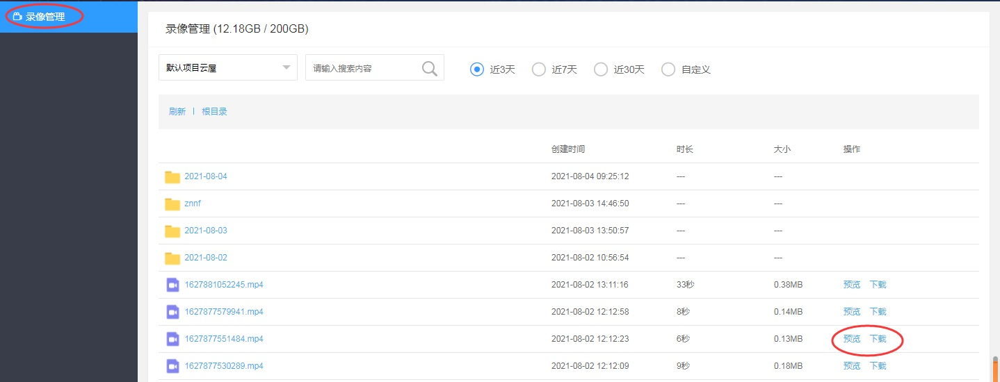

# 云端录制

## 功能介绍

在服务器上对房间内的音视频、影音共享、屏幕共享等通讯内容进行录制，支持自定义录制内容和布局，录制文件在服务器保存，可以通过[WEB API](https://sdk.cloudroom.com/sdkdoc/webapi/)下载和删除

## 示例项目

云屋SDK 在 GitHub 上提供已经实现[设置音频属性](https://github.com/cloudroomSDK/API-Demo/tree/main/Linux/src/TestSvrRecord)功能的开源示例项目。你可以下载体验或查看其中的源代码。


<h2 id=record_startSvrMixer> 1.开通云端录制服务</h2>

- 请确保您已成功[注册](https://sdk.cloudroom.com/mgr_sdk/register.html)了一个帐号。</br>
- 请联系商务为对应帐号开通“云端录制服务”。

<h2 id=record_startSvrMixer> 2.开始云端录制</h2>

- 录制左右布局示例图:


- 调用接口：

```cpp

//配置混图器，合流模式，录制尺寸640*360，自定义布局：左边为usr1的1号摄像头，右边为usr2的1号摄像头
string mixerCfg = "{\
\"mode\": 0,\
\"videoFileCfg\":  {\"vWidth\":640,\"vHeight\":360,\"mixedLayotu\":1,\
\"svrPathName\":\"xxxxxxx\",\"layoutConfig\": [\
{\"type\":0,\"keepAspectRatio\":1,\"left\":0,\"top\":90,\"width\":320,\"height\":180,\"param\":{\"camid\":\"usr1.1\"}},\
{\"type\":0,\"keepAspectRatio\":1,\"left\":320,\"top\":90,\"width\":320,\"height\":180,\"param\":{\"camid\":\"usr2.1\"}}]\
}}";

string rsltMixerID; //开启成功返回混图器ID
CRVSDK_ERR_DEF err = g_sdkMain->getSDKMeeting().createCloudMixer(mixerCfg.constData(), rsltMixerID);
if (err != CRVSDKERR_NOERR)
{
    //开启 云端录制 出错
    ...
}
```

相关API请参考:</br>
[createCloudMixer](Apis.md#createCloudMixer)</br>


<h2 id=record_updateSvrMixerContent> 3.更新云端录制内容</h2>

- 更新成画中画布局示例图:


- 接口调用：

```cpp

//混图器内容：画中画布局(示例图如下， 底层640*360， 上层160*90)，底层为usr1的1号摄像头， 上层为usr2的1号摄像头
string mixerCfg = "{\
\"videoFileCfg\": {\"layoutConfig\": [\
{\"type\":0,\"keepAspectRatio\":1,\"left\":0,\"top\":0,\"width\":640,\"height\":360,\"param\":{\"camid\":\"usr1.1\"}},\
{\"type\":0,\"keepAspectRatio\":1,\"left\":475,\"top\":265,\"width\":160,\"height\":90,\"param\":{\"camid\":\"usr2.1\"}}]\
}}";

CRVSDK_ERR_DEF err = g_sdkMain->getSDKMeeting().updateCloudMixerContent(m_mixerID, mixerCfg);
if (err != CRVSDKERR_NOERR)
{
    //更新出错
}

```

相关API请参考:</br>
[updateCloudMixerContent](Apis.md#updateCloudMixerContent)</br>


<h2 id=record_stopSvrMixer> 4.停止云端录制</h2>

停止云端录制后，也会触发事件[notifyCloudMixerStateChanged](Apis.md#notifyCloudMixerStateChanged)

- 接口调用：
```cpp

g_sdkMain->getSDKMeeting().destroyCloudMixer(m_mixerID);
```

相关API请参考:</br>
[destroyCloudMixer](Apis.md#destroyCloudMixer)</br>


<h2 id=record_callBack> 5.云端录制回调通知</h2>

录制过程中都会录制状态变化事件、录制文件信息变化通知。在此可以实时获得录制状态、录制文件当前的时长、大小，以及录制异常等信息。

- 回调通知：

```cpp
//云端录制状态变化通知
void DlgSeverRecord::notifyCloudMixerStateChanged(const char* mixerID, CRVSDK_MIXER_STATE state, const char* exParam, const char* operUserID)
{
  //状态处理
  ...
}

```

```cpp
//云端录制输出内容变化通知
void DlgServerRecord::notifyCloudMixerOutputInfoChanged(const char* mixerID, const char* jsonStr)
{
  //状态处理, 文件时长、大小等处理
}
```


相关API请参考:</br>
[notifyCloudMixerStateChanged](Apis.md#notifyCloudMixerStateChanged)</br>
[notifyCloudMixerOutputInfoChanged](Apis.md#notifyCloudMixerOutputInfoChanged)</br>

<h2 id=record_getFile> 6.获取录像</h2>

录像停止后，录像文件会开始上传到录像文件存储服务器中（可关注[notifyCloudMixerOutputInfoChanged](Apis.md#notifyCloudMixerOutputInfoChanged)通知，得到上传完成事件）。 

可以通过[WEB API](http://sdk.cloudroom.com/sdkdoc/webapi/)进行录像文件查询、下载和删除等处理。

也可以登录[管理后台](https://sdk.cloudroom.com/mgr_sdk/)，在管理页面上回放和下载录像：


