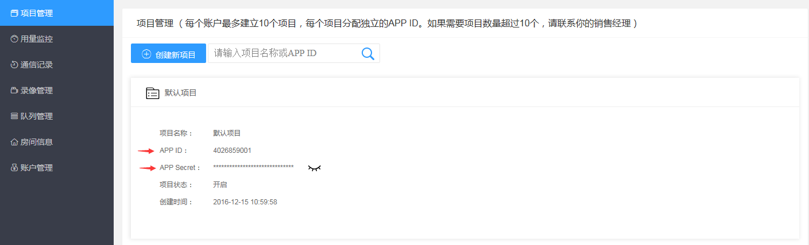

# 准备工作

## 帐号申请

[点此注册](https://sdk.cloudroom.com/mgr_sdk/register.html)一个账号，或者联系商务代为开通，或在网站咨询客服。

<p id=getappid></p>

## 创建项目

可以在[管理平台](https://sdk.cloudroom.com/mgr_sdk/)中创建新的项目（系统有一个默认项目，可以直接使用）。  
项目信息页内可得到此项目的 App ID 及 App Secret。如下图：  


## 防火墙开通

在使用云屋 SDK 提供的相关服务之前，您需要打开下面这些特定的端口：

<table border=0 cellpadding=0 cellspacing=0 style='border-collapse:collapse;table-layout:fixed;'>
    <thead>
        <tr >
            <th style='width:12%;text-align:center'>端口</th>
            <th style='width:25%;text-align:center'>功能说明</th>
            <th style='width:23%;text-align:center'>Windows, Android, iOS,web插件版 SDK</th>
            <th style='width:10%;text-align:center'>H5 SDK</th>
            <th style='width:10%;text-align:center'>小程序SDK</th>
            <th style='width:10%;text-align:center'>直播观看SDK</th>
            <th style='width:10%;text-align:center'>后台管理页面</th>
        </tr>
    </thead>
    <tbody>
    <tr>
        <td>TCP 2725</td>
        <td style='text-align:center'>后台管理服务端口</td>
        <td></td>
        <td></td>
        <td></td>
        <td></td>
        <td style='text-align:center'>√</td>
    </tr>
    <tr>
        <td>TCP 2726</td>
        <td style='text-align:center'>https服务端口<br />(SDK缺省使用https)
        </td>
        <td style='text-align:center'>√</td>
        <td style='text-align:center'>√</td>
        <td style='text-align:center'>√</td>
        <td style='text-align:center'>√</td>
        <td style='text-align:center'></td>
    </tr>
    <tr>
        <td>TCP 2728</td>
        <td style='text-align:center'>信令服务端口</td>
        <td style='text-align:center'>√</td>
        <td style='text-align:center'>√</td>
        <td style='text-align:center'>√</td>
        <td style='text-align:center'>√</td>
        <td style='text-align:center'></td>
    </tr>
    <tr>
        <td>TCP 1935</td>
        <td style='text-align:center'>直播观看端口</td>
        <td></td>
        <td></td>
        <td style='text-align:center'>√</td>
        <td style='text-align:center'>√</td>
        <td style='text-align:center'></td>
    </tr>
    <tr>
        <td>UDP 2698</td>
        <td style='text-align:center'>服务器音视频流端口</td>
        <td style='text-align:center'>√</td>
        <td></td>
        <td></td>
        <td></td>
        <td></td>
    </tr>
    <tr>
        <td>UDP 2699</td>
        <td style='text-align:center'>服务器音视频流端口(H5)</td>
        <td></td>
        <td style='text-align:center'>√</td>
        <td></td>
        <td></td>
        <td></td>
    </tr>    
    </tbody>
</table>

## SDK 集成准备

<span size="3" color="red">集成流程如下：</span>

1. 创建一个 flutter 项目

2. 使用 SDK

3. 添加动态权限

```
Manifest.permission.CAMERA
Manifest.permission.RECORD_AUDIO
Manifest.permission.WRITE_EXTERNAL_STORAGE
Manifest.permission.READ_PHONE_STATE
```

可以使用 flutter 插件，例如：permission_handler

4. 编写混淆文件，打开 app 目录下的 proguard-rules.pro 文件，添加如下代码。

```properties

-keep class com.cloudroom.**  { *; }
-keep class org.crmedia.**  { *; }
-keep class com.example.cr_flutter_sdk.** { *; }

```
