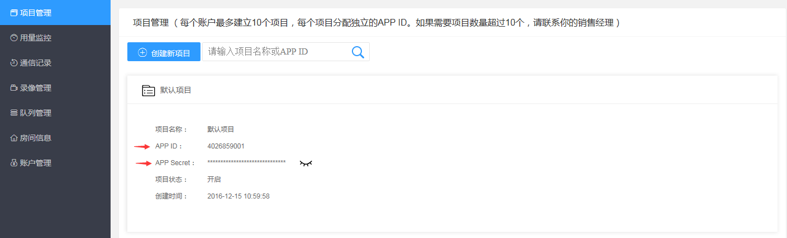

# 跑通示例项目

<h2 id="getAccount">帐号申请</h2>

[点此注册](https://sdk.cloudroom.com/mgr_sdk/register.html)一个账号，或者联系商务代为开通，或在网站咨询客服。

<h2 id="createProject">创建项目</h2>

可以在 [管理平台](https://sdk.cloudroom.com/mgr_sdk/) 中创建新的项目（系统有一个默认项目，可以直接使用），如下图：

为了保障接口安全，后台不再显示App Secret，所以请在创建项目成功显示App Secret时妥善保存好。 如果遗忘只能如下图更换App Secret：

<h2 id="firewall">防火墙开通</h2>

在使用云屋SDK提供的相关服务之前，您需要打开下面这些特定的端口：

<table border=0 cellpadding=0 cellspacing=0 style='border-collapse:collapse;table-layout:fixed;'>
    <thead>
        <tr >
            <th style='width:12%;text-align:center'>端口</th>
            <th style='width:25%;text-align:center'>功能说明</th>
            <th style='width:23%;text-align:center'>Windows, Linux, Android, iOS, macOS, 网页插件</th>
            <th style='width:10%;text-align:center'>H5 SDK</th>
            <th style='width:10%;text-align:center'>小程序SDK</th>
            <th style='width:10%;text-align:center'>直播观看SDK</th>
            <th style='width:10%;text-align:center'>后台管理页面</th>
        </tr>
    </thead>
    <tbody>
    <tr>
        <td>TCP 2725</td>
        <td style='text-align:center'>后台管理服务端口</td>
        <td></td>
        <td></td>
        <td></td>
        <td></td>
        <td style='text-align:center'>√</td>
    </tr>
    <tr>
        <td>TCP 2726</td>
        <td style='text-align:center'>https服务端口 (SDK缺省使用https)
        </td>
        <td style='text-align:center'>√</td>
        <td style='text-align:center'>√</td>
        <td style='text-align:center'>√</td>
        <td style='text-align:center'>√</td>
        <td style='text-align:center'></td>
    </tr>
    <tr>
        <td>TCP 2728</td>
        <td style='text-align:center'>信令服务端口</td>
        <td style='text-align:center'>√</td>
        <td style='text-align:center'></td>
        <td style='text-align:center'></td>
        <td style='text-align:center'></td>
        <td style='text-align:center'></td>
    </tr>
    <tr>
        <td>TCP 1935</td>
        <td style='text-align:center'>服务器音视频流端口(rtmp)</td>
        <td></td>
        <td></td>
        <td style='text-align:center'>√</td>
        <td style='text-align:center'>√</td>
        <td style='text-align:center'></td>
    </tr>
    <tr>
        <td>UDP 2698</td>
        <td style='text-align:center'>服务器音视频流端口</td>
        <td style='text-align:center'>√</td>
        <td></td>
        <td></td>
        <td></td>
        <td></td>
    </tr>
    <tr>
        <td>UDP 2699</td>
        <td style='text-align:center'>服务器音视频流端口(H5)</td>
        <td></td>
        <td style='text-align:center'>√</td>
        <td></td>
        <td></td>
        <td></td>
    </tr>    
    </tbody>
</table>

<h2 id="download">Demo下载（含SDK文件）</h2>

- 您可以直接访问线上 [最新版本的Demo](https://sdk.cloudroom.com/web/webrtc/)
- 也可以 [点此下载](https://sdk.cloudroom.com/download.html) 最新版本的离线版H5SDK及Demo

<h2 id="run">运行Demo</h2>

- 支持将静态资源部署到 Nginx Apache 等服务器上，在线访问（需注意：开发及生产环境限制）
- 也支持本地File:///协议直接访问（双击或者鼠标右键选择浏览器打开）

<h2 id="environment">开发及生产环境限制</h2>

- Web音视频SDK需调用浏览器的媒体设备（摄像头、麦克风等），为保护用户隐私，各浏览器会采用不同的安全限制。以谷歌浏览器为例，以下是能互通音视频的几种方案： 
    * http + 本地服务，localhost 或 127.0.0.1（仅用于本机浏览开发，适用开发环境）
    * https + ip + SSL自签证书 (局域网互通方案，会报不安全的提示，适用开发环境)
    * https + 域名 + SSL域名证书（推荐该方案，适用开发、生产环境）

<h2 id="loginSetting">Demo登录设置</h2>

- 在对应场景的Demo登录界面填入SDK服务器地址（带端口）、appID、appSecret等信息，登录或进入房间既可开始体验音视频服务