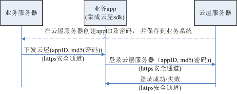
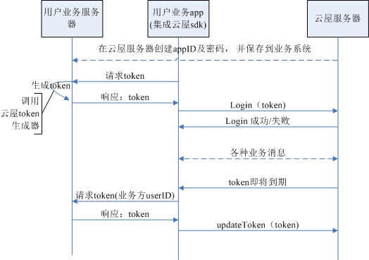

# 登录鉴权

<b>SDK登录鉴权的目的： </b>  
确保只有合法的身份才能使用sdk接入到服务器；

<b>SDK提供两种登录鉴权方案：</b>  
1、密码鉴权方案： 此方案简单，配合https通信，适用于一般的安全要求；  
2、动态token鉴权方案： 此方案每次登录token都不一样，并且可自定义token的有效期，具有更高的安全性；

- 密码鉴权方案说明

1. 在云屋web管理页面上，创建appID及密码，然后保存到业务服务器上；
2. 在app连接到业务服务器时，通过安全通道将“appID及md5(密码)”下发给app并配置给sdk；
3. sdk通过https向云屋服务器发起登录时携带“appID及md5(密码)”；
4. 云屋服务器校验密码是否正确；

- 动态token鉴权方案说明

1. 在云屋web管理页面上，创建appID及密码，然后保存到业务服务器上；
1. App调用sdk登录之前，去业务服务器请求“token”；
1. 业务服务器调用[云屋token生成器](https://www.cloudroom.com/pages/tokenGenerator/)，生成token并返回给App；
1. App收到token后，调用sdk登录；
1. sdk通过https向云屋服务器发起登录时携带“appID及token”；
1. 云屋服务器校验token；
1. 在token即将过期前30秒，服务器通知sdk，sdk会通知app；
1. app应该尽快从业务服务器获取到新的token并提交给sdk，sdk将其更新到云屋服务器后，就可保证通信不中断；（如果token到期前没有更新有效token，通信将被结束）
