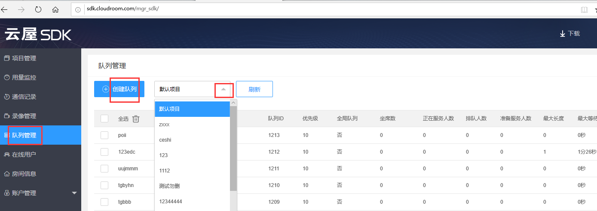

# 排队

<h2 id=introduction>功能简介</h2>    

在呼叫中心的业务场景下，有多个客户呼叫进来，有多个坐席提供服务，简单的一对一呼叫无法满足业务需求。此时可以使用我们的排队功能，客户不再直接呼叫某个坐席，而是呼叫到一个坐席队列，由系统自动给客户分配一个空闲的坐席。
- 当坐席提供的是通用型服务时，多个坐席可以服务于一个队列，客户呼叫这个队列，系统就会自动给客户分配一个空闲坐席。
- 如果是业务高峰期没有空闲的坐席了，客户将在队列中等待，一旦有坐席空闲了就会自动被分配给最先开始等待的客户。
- 坐席可以同时服务多个队列，队列有优先级，当坐席从忙变成空闲时，优先被分配给高优先级的队列里的客户。
- 同一个队列内的坐席可以配置不同的坐席优先级，客户接入时如果同时存在多个空闲坐席，会把客户分配给优先级更高的坐席。


<font color="#FF0000">注意：在登录成功并且启用呼叫功能的情况下才可以使用排队功能</font>

  -----

<h2 id=flow>排队流程</h2>

排队流程如下：

 1. [创建队列](#createQueue)
 1. [初始化队列](#initQueue)
 1. [获取队列信息](#getQueue)
 1. [坐席进入队列](#servicesOpr)
 1. [客户排队](#clientQueue)
 1. [系统给坐席分配客户](#autoAssignUser)
 1. [坐席呼叫客户](#callClient)


<h3 id=createQueue>1.创建队列</h3>

可以通过两种方式创建队列。第一种是[登录云屋SDK后台](https://sdk.cloudroom.com/mgr_sdk/login.html)并创建。如下图：
 

第二种是通过[Web API](https://sdk.cloudroom.com/sdkdoc/webapi/)创建。


<h3 id=initQueue>2.初始化队列</h3>


在登录成功后，初始化队列信息

- 调用接口：

```js
//操作完成回调CRVideo_InitQueueDatRslt
CRVideo_InitQueueDat()
```

- 回调通知：

```js
//队列初始化操作结果
CRVideo_InitQueueDatRslt.callback = function(sdkErr, cookie){
    if(sdkErr == 0){
        //初始化队列成功后，才可以获取队列相关信息并展示。
    }else{
        console.log("初始化队列信息 失败，错误码： "+ sdkErr);
    }
}

```

相关API请参考： 
* [CRVideo_InitQueueDat](API.md#CRVideo_InitQueueDat)
* [CRVideo_InitQueueDatRslt](API.md#CRVideo_InitQueueDatRslt)


<h3 id=getQueue> 3.获取队列信息</h3>


在初始化队列成功后，才可以使用获取队列信息。并且可以多次获取。

- 调用接口：

```js
//获取队列信息
var queueList = CRVideo_GetAllQueueInfo(); 
```

相关API请参考： 
* [CRVideo_GetAllQueueInfo](API.md#CRVideo_GetAllQueueInfo)

相关结构定义请参考：
* [CRVideo_QueueInfo](TypeDefinitions.md#CRVideo_QueueInfo)


<h3 id=servicesOpr>4.坐席进入队列</h3>


- 调用接口：

```js
//开始服务某个队列(可以多次调用，开启对多个队列的服务) .
CRVideo_StartService(queID);

//停止服务某个队列 
CRVideo_StopService(queID);

//获取本坐席服务的所有队列
var GetServingQueues = CRVideo_GetServingQueues();
```

- 回调通知：

```js
// 开始服务队列操作结果
CRVideo_StartServiceRslt.callback = function(queID, sdkErr, cookie){
    if(sdkErr == 0){
        //开始服务队列成功
    }else{
        console.log("开始服务队列 失败，错误码： "+ sdkErr);
    }
}

//停止服务队列操作结果
CRVideo_StopServiceRslt.callback = function(queID, sdkErr, cookie){
    if(sdkErr == 0){
        //停止服务队列成功
    }else{
        console.log("停止服务队列 失败，错误码： "+ sdkErr);
    }
}

// 开始/停止服务队列，会触发队列状态变化通知
CRVideo_QueueStatusChanged.callback = function(queStatus){

}
```

相关API请参考：   
* [CRVideo_StartService](API.md#CRVideo_StartService)
* [CRVideo_StopService](API.md#CRVideo_StopService)
* [CRVideo_StartServiceRslt](API.md#CRVideo_StartServiceRslt)
* [CRVideo_StopServiceRslt](API.md#CRVideo_StopServiceRslt)
* [CRVideo_GetServingQueues](API.md#CRVideo_GetServingQueues)
* [CRVideo_QueueStatusChanged](API.md#CRVideo_QueueStatusChanged)

相关结构定义请参考：
* [CRVideo_QueStatus](TypeDefinitions.md#CRVideo_QueStatus)


<h3 id=clientQueue>5.客户排队</h3>


客户选择一个队列进行排队，每次只能排一个队列

- 调用接口：

```js
// 客户开始排队， 操作完成回调CRVideo_StartQueuingRslt
CRVideo_StartQueuing(queID)

//客户停止排队，操作完成回调CRVideo_StopQueuingRslt
CRVideo_StopQueuing()
```

- 回调通知：

```js
// 开始排队操作结果
CRVideo_StartQueuingRslt.callback = function(sdkErr, cookie){
    if(sdkErr == 0){ //开始排队操作成功
     }else{
         console.log("开始排队操作失败，错误码：" + sdkErr);
     }
}

// 停止排队操作结果
CRVideo_StopQueuingRslt.callback = function(sdkErr, cookie){
    if(sdkErr == 0){ //停止排队操作成功
     }else{
         console.log("停止排队操作失败，错误码：" + sdkErr);
     }
}
```

```js
//开始/停止排队，会触发队列状态变化通知
CRVideo_QueueStatusChanged.callback = function(queStatus){

}

//排队信息变化通知
CRVideo_QueuingInfoChanged.callback = function(queuingInfo){

}
```

相关API请参考：
* [CRVideo_StartQueuing](API.md#CRVideo_StartQueuing)
* [CRVideo_StopQueuing](API.md#CRVideo_StopQueuing)
* [CRVideo_StartQueuingRslt](API.md#CRVideo_StartQueuingRslt)
* [CRVideo_StopQueuingRslt](API.md#CRVideo_StopQueuingRslt)
* [CRVideo_QueuingInfoChanged](API.md#CRVideo_QueuingInfoChanged)

相关结构定义请参考：
* [CRVideo_QueuingInfo](TypeDefinitions.md#CRVideo_QueuingInfo)


<h3 id=autoAssignUser>6.系统给坐席分配客户</h3>


客户分配模式有自动和手动两种：
- 在自动分配模式下，坐席一旦空闲系统就会立即分配当前排队的客户过来，适用于坐席可以持续提供服务的业务场景。
- 在手动分配模式下，坐席空闲后系统不自动分配客户，而是坐席准备好后手动触发分配一个当前排队的客户，适用于坐席接待完客户后需要进行信息录入之类的善后工作，或者需要在接待新客户之前进行一些准备工作的业务场景。


自动分配模式:

- 回调通知：

```js
// 系统自动安排客户
CRVideo_AutoAssignUser.callback = function(QueUser){
    if(/*接受系统分配的客户*/){
        CRVideo_AcceptAssignUser(QueUser.queID, QueUser.userID);

        //接下来做其他任务……  例如：创建房间

    }else{//拒绝系统分配的客户
        CRVideo_RejectAssignUser(user.queID, user.usrID);
    }

}

//接受或拒绝分配的客户的操作结果
CRVideo_ResponseAssignUserRslt.callback = function(sdkErr, cookie){
    if(sdkErr == 0){
        console.log("接受或拒绝系统分配的客户成功");
    }else{
        console.log("接受或拒绝系统分配的客户失败，错误码： "+ sdkErr);
    }
}

//系统取消已经安排的客户
CRVideo_CancelAssignUser.callback = function(queID, userid){
    console.log("系统取消已经安排的客户,坐席不应该再进入房间……");
}
```

相关API请参考： 
* [CRVideo_AutoAssignUser](API.md#CRVideo_AutoAssignUser)
* [CRVideo_AcceptAssignUser](API.md#CRVideo_AcceptAssignUser)
* [CRVideo_RejectAssignUser](API.md#CRVideo_RejectAssignUser)
* [CRVideo_ResponseAssignUserRslt](API.md#CRVideo_ResponseAssignUserRslt)
* [CRVideo_CancelAssignUser](API.md#CRVideo_CancelAssignUser)


手动分配模式:

- 调用接口：

```js
//坐席请求客户分为 2步：
//1.开启免打扰状态
CRVideo_SetDNDStatus(1,cookie)：

// 2. 请求分配一个客户
CRVideo_ReqAssignUser(cookie);
```

- 回调通知：

```js
//设置免打扰成功通知
CRVideo_SetDNDStatusSuccess.callback = function(cookie){

}

//设置免打扰失败通知
CRVideo_SetDNDStatusFail.callback = function(sdkErr, cookie){
    console.log("设置免打扰失败，错误码：" + sdkErr);    
}

//请求分配客户操作结果
CRVideo_ReqAssignUserRslt.callback = function(sdkErr, user, cookie){
    if(sdkErr == 0){
        //请求分配客户成功，接下来做其他任务……  例如：创建房间
    }else{
        console.log("请求分配客户失败，错误码： "+ sdkErr);
    }
}

```

相关API请参考:
* [CRVideo_SetDNDStatus](API.md#CRVideo_SetDNDStatus) 
* [CRVideo_SetDNDStatusSuccess](API.md#CRVideo_SetDNDStatusSuccess)
* [CRVideo_SetDNDStatusFail](API.md#CRVideo_SetDNDStatusFail)
* [CRVideo_ReqAssignUser](API.md#CRVideo_ReqAssignUser)
* [CRVideo_ReqAssignUserRslt](API.md#CRVideo_ReqAssignUserRslt)


<h3 id=callClient>7.坐席呼叫客户</h3>

- 调用接口：

```js
//发起呼叫，邀请客户进入房间。
var callID = CRVideo_Call(UID, meetObj, usrExtDat, cookie)
```

呼叫相关流程及API请参考:
* [呼叫功能](Call.md)


