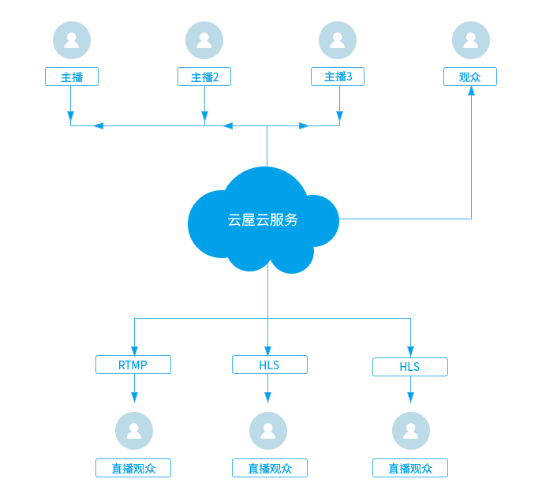

# 云端直播推流

<h2 id=introduction>功能简介</h2>

用于多个主播实时连麦互动。技术实现上，我们会把房间里多个主播的音视频在服务器合成一路流后推流到CDN流媒体服务器，直播观众可以获取RTMP或HLS流观看直播。

<h3 id=layout style="font-weight:normal;">架构图</h3>  

云端直播推流架构图：
</img>

-------

<h2 id=flow>使用流程</h2>

云端直播推流使用流程如下：

1. [创建直播间并获得推流地址](#addr)
1. [开始云端直播推流](#record_startSvrMixer)
1. [更新云端直播推流内容](#record_updateSvrMixerContent)
1. [观众观看直播](#record_getSvrMixerState)
1. [停止云端直播推流](#record_stopSvrMixer)
1. [回放点播](#record_vod)

<h3 id=addr> 1.创建直播间并获得推流地址</h3>

- 创建直播间请参见：Web API [创建直播](https://sdk.cloudroom.com/sdkdoc/live/createLiveAPI.html)。
- 获取直播推流地址请参见：Web API [获取推流地址](https://sdk.cloudroom.com/sdkdoc/live//queryLiveAPI.html)。


<h3 id=record_startSvrMixer> 2.开始云端直播推流</h3>


- 调用接口：

```js
// 云端推流推荐分辨率
var record_size_arr = [ 
	[640, 360, 400],
	[964, 480, 600],
	[1280, 720, 1200]
];

var mixerID = "1";  //生成一个混图器id
var size = 0;   //使用第1个分辨率

var rw = record_size_arr[size][0];  //640
var rh = record_size_arr[size][1];  //360
var bitRate = record_size_arr[size][2] * 1000;  //400 * 1000

var mw = rw / 2;    //每个视频的宽度
var mh = mw * 9 / 16; //每个视频的高度
var mtop = (rh - mh) / 2;   //放在画布的相对高度，这里是计算出视频垂直居中的位置


//配置混图器编码参数
var mutiMixerCfgs = [
    {
        "id": mixerID,
        "cfg": {
            "width": rw,
            "height": rh,
            "frameRate": 8,
            "bitRate": bitRate,
            "defaultQP": 26
        };
    }
];


//左视频图像的内容配置
var leftCon = {
    "type": 0; //0： 录制类型为视频
    "left": 0 ;
    "top": mtop;   //视频图像垂直居中
    "width": mw;
    "height":  mh;
    //camid参数为: user1.1 ,表示该内容需要录制userID是user1的1号摄像头。后方可传入-1，表示为录制默认摄像头
    "param": {"camid": "user1.1"};  
    "keepAspectRatio": 1;
};
//右视频图像的内容配置
var rightCon = {
    "type": 0; //0： 录制类型为视频
    "left": mw;
    "top": mtop;   //视频图像垂直居中
    "width": mw;
    "height":  mh;
    "param": {"camid": "user2.1"};
    "keepAspectRatio": 1;
};  

//配置混图器内容
var mutiMixerContents = [
    {
        "id": mixerID,
        "content": [ leftCon ,rightCon ]
    }
];

//配置混图器输出
var mutiMixerOutputs = [ 
    {
        "id": mixerID,
        "output": [
            {"type":1,"liveUrl": "rtmp://xxx"} //配置推流地址,地址来自 步骤1获取的推流地址
        ]
    }
];

//开始直播推流，云端推流开启后会回调CRVideo_SvrMixerStateChanged接口
CRVideo_StartSvrMixer(mutiMixerCfgs, mutiMixerContents, mutiMixerOutputs);
```

<h4 id=layout style="font-weight:normal;">（1）左右布局示例图:  </h4>  


- 回调通知：

```js
//云端直播推流状态变化通知 
CRVideo_SvrMixerStateChanged.callback = function(state, err, operatorID){
	console.log("CRVideo_SvrMixerStateChanged, state:" + state + ",err:" + err + ",operatorID:" + operatorID);
}

```

相关API请参考:
- [CRVideo_StartSvrMixer](API.md#CRVideo_StartSvrMixer)
- [CRVideo_SvrMixerStateChanged](API.md#CRVideo_SvrMixerStateChanged)

相关结构定义请参考：
- [CRVideo_MutiMixerCfg](TypeDefinitions.md#CRVideo_MutiMixerCfg)
- [CRVideo_MutiMixerContent](TypeDefinitions.md#CRVideo_MutiMixerContent)
- [CRVideo_MutiMixerOutput](TypeDefinitions.md#CRVideo_MutiMixerOutput)


<h3 id=record_updateSvrMixerContent> 3.更新云端直播推流内容</h3>


- 接口调用：

```js
// 云端录制推荐分辨率
var record_size_arr = [ 
	[640, 360, 400],
	[964, 480, 600],
	[1280, 720, 1200]
];

var mixerID = "1";  //取之前的混图器id
var size = 0;   //使用第1个分辨率

//更新录制布局为：画中画
//混图器内容：画中画布局(示例图如下， 底层640*360， 上层213*120)，底层为user1的1号摄像头， 上层为user2的1号摄像头

var bigW = record_size_arr[size][0];  //640，底层视频的宽度
var bigH = record_size_arr[size][1];  //360，底层视频的高度

var smallH = bigH / 3;  //缩放3倍作为顶层视频的高度
var smallW = smallH * 16 / 9;   //视频宽高比为16：9，计算出顶层视频宽度

//底层视频图像的内容配置
var underCon = {
    "type": 0; //0： 录制类型为视频
    "left": 0 ;
    "top": 0;
    "width": bigW;
    "height":  bigH;
    //camid参数为: user1.1 ,表示该内容需要录制userID是user1的1号摄像头。后方可传入-1，表示为录制默认摄像头
    "param": {"camid": "user1.1"};  
    "keepAspectRatio": 1;
};
//顶层视频图像的内容配置
var topCon = {
    "type": 0; //0： 录制类型为视频
    "left": bigW - smallW;
    "top": bigH - smallH;
    "width": smallW;
    "height":  smallH;
    "param": {"camid": "user2.1"};
    "keepAspectRatio": 1;
};  

//配置混图器内容
var mutiMixerContents = [
    {
        "id": mixerID,
        "content": [ underCon ,topCon ] //数组后面的画面将会覆盖前面的画面
    }
];

//更新录制内容，录制更新后会通知CRVideo_SvrMixerCfgChanged接口
CRVideo_UpdateSvrMixerContent(mutiMixerContents);

```

<h4 id=layout_overlap style="font-weight:normal;">（2）画中画布局示例图:  </h4>  


相关API请参考:
- [CRVideo_UpdateSvrMixerContent](API.md#CRVideo_UpdateSvrMixerContent)


<h3 id=record_getSvrMixerState> 4.观众观看直播</h3>

通过 [播放器SDK](https://sdk.cloudroom.com/sdkdoc/live/SDK_summary.html)观看直播.


<h3 id=record_stopSvrMixer> 5.停止云端直播推流</h3>

停止云端直播推流后，也会触发事件[CRVideo_SvrMixerStateChanged](API.md#CRVideo_SvrMixerStateChanged)

- 接口调用：
```js
CRVideo_StopSvrMixer();
```

相关API请参考:
* [CRVideo_StopSvrMixer](API.md#CRVideo_StopSvrMixer)

<h3 id=record_vod> 6.回放点播</h3>

通过 [云屋点播API](https://sdk.cloudroom.com/sdkdoc/live/index1.html)回放点播。