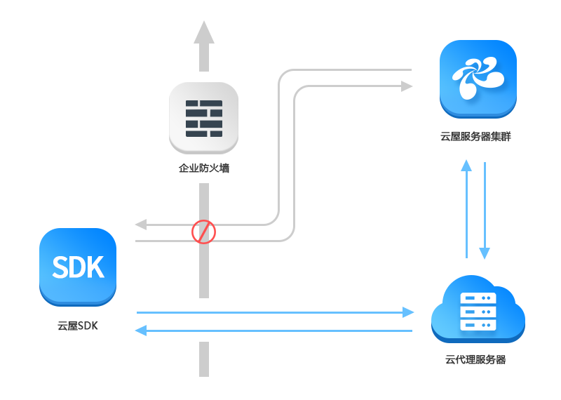

# 使用云代理

## 云代理介绍

对于安全需求较高的企业用户比如金融、医院、高校、大型企业，设置防火墙可以限制员工访问不安全网站，保护内部信息安全。

云屋提供了云代理服务来接入这类有防火墙限制的用户，只需要在防火墙上将特定的域名及端口列入白名单，就可以正常访问云屋的音视频云服务。

## 使用云代理

### 将云屋云代理服务器和端口添加到企业防火墙的白名单

&emsp;云屋云代理服务器域名: proxy.cloudroom.com

&emsp;云屋云代理服务端口与[云屋SDK需要的端口](BeforeDevelop.md#firewall)保持一致，无需暴露额外端口

### 设置到登录服务器

&emsp;把[登录](IntegratedGuide.md#login)服务器地址替换为:proxy.cloudroom.com
