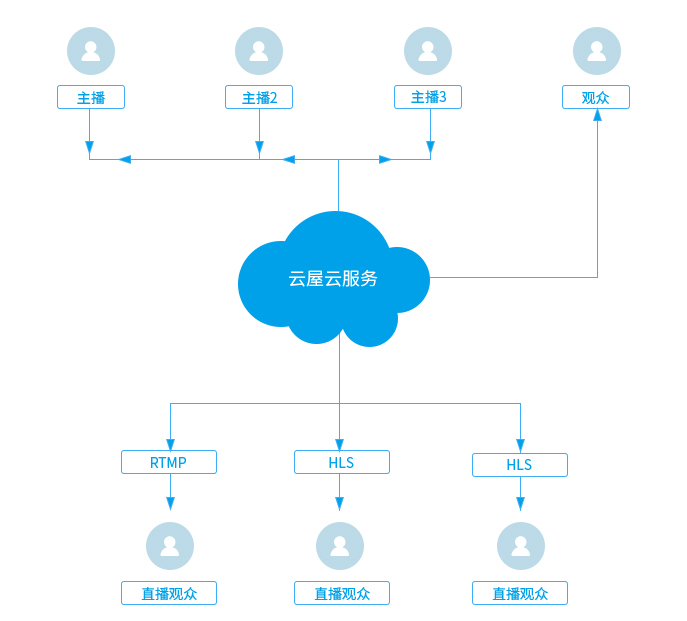

# 云端直播推流

## 功能介绍

用于多个主播实时连麦互动。技术实现上，我们会把房间里多个主播的音视频在服务器合成一路流后推流到CDN流媒体服务器，直播观众可以获取RTMP或HLS流观看直播。
<p id=layout style="font-weight:normal;">互动直播架构图:  </p>
</img>

<h2 id=addr> 1.创建直播间并获得推流地址</h2>

- 创建直播间请参见：[Web API 创建直播](https://sdk.cloudroom.com/sdkdoc/live/createLiveAPI.html)。
- 获取直播推流地址请参见：[Web API 获取推流地址](https://sdk.cloudroom.com/sdkdoc/live/queryLiveAPI.html)。


<h2 id=startSvrMixer> 2.开始互动直播</h2>

- 左右布局示例图：


- 调用接口：

```oc
//配置混图器编码参数：尺寸为640*360，其他采用默认设置
MixerCfg *cfg = [[MixerCfg alloc] init];
[cfg setDstResolution:(CGSize){640, 360}];
  
NSMutableDictionary<NSString*,MixerCfg*> *cfgDic = [NSMutableDictionary dictionary];
[cfgDic setValue:cfg forKey:@"1"];

// 图像内容集合 - 创建左右布局的摄像头录制内容，
NSMutableArray<RecContentItem *> *contents = [NSMutableArray array];
//自己的摄像头（左边布局）, 设置摄像头录制视频大小，由于左右布局， 宽度只有录制布局的一半
CGRect leftRect = CGRectMake(0, 0, mixerCfg.dstResolution.width/2, mixerCfg.dstResolution.height);
// 添加到内容列表
RecVideoContentItem *leftVideoItem = [[RecVideoContentItem alloc] initWithRect:leftRect userID:myUserID camID:-1];
[contents addObject:leftVideoItem];
  
//其他人的摄像头（右边布局）
CGRect rightRect = CGRectMake(mixerCfg.dstResolution.width/2, 0, mixerCfg.dstResolution.width/2, mixerCfg.dstResolution.height);
RecVideoContentItem* rightVideoItem = [[RecVideoContentItem alloc] initWithRect:rightRect userID:otherUserID camID:-1];
  
// 添加到内容列表
[contents addObject:rightVideoItem];
  
MixerContent *recContent = [[MixerContent alloc]init];
recContent.contents = [contents copy];
  
NSMutableDictionary<NSString*,MixerContent*> *contentDic = [NSMutableDictionary dictionary];
[contentDic setObject:recContent forKey:@"1"];


//配置混图器输出：直播推流地址为rtmp://xxx
NSMutableArray<OutputCfg*> *outputCfgs = [NSMutableArray array];

//添加推流配置
OutputCfg* outputStearmCfg = [[OutputCfg alloc]init];
[outputStearmCfg setType:OUT_LIVE];
[outputStearmCfg setLive:NO];
[outputStearmCfg setLiveUrl:@"rtmp://xxx"];
[outputCfgs addObject:outputStearmCfg];

NSMutableDictionary<NSString*,MixerOutput*> *outputDic = [NSMutableDictionary dictionary];
MixerOutput* output = [[MixerOutput alloc]init];
output.outputs = outputCfgs;
[outputDic setObject:output forKey:@"1"];


int rst = [[CloudroomVideoMeeting shareInstance] startSvrMixer:cfgDic contents:contentDic outputs:outputDic];;
if(rst != 0)
{
    //开启 互动直播 出错!
    ...
}
```

相关API请参考:
* [startSvrMixer](Apis.md#startSvrMixer)
* [svrMixerStateChanged](Apis.md#svrMixerStateChanged)


<h2 id=updateSvrMixerContent> 3.更新互动直播内容</h2>

- 更新成画中画布局示例图：


- 接口调用：

```oc
//更新为画中画模式
NSMutableArray<RecContentItem *> *contents = [NSMutableArray array];
//自己的摄像头
CGRect bigRect = CGRectMake(0, 0, mixerCfg.dstResolution.width, mixerCfg.dstResolution.height);
// 添加到内容列表
RecVideoContentItem *bigVideoItem = [[RecVideoContentItem alloc] initWithRect:bigRect userID:myUserID camID:-1];
[contents addObject:leftVideoItem];
  
//右下角摄像头
CGRect rightRect = CGRectMake(mixerCfg.dstResolution.width-160, mixerCfg.dstResolution.height - 90, 160 ,90);
RecVideoContentItem* rightVideoItem = [[RecVideoContentItem alloc] initWithRect:rightRect userID:otherUserID camID:-1];
  
// 添加到内容列表
[contents addObject:rightVideoItem];
  
MixerContent *recContent = [[MixerContent alloc]init];
recContent.contents = [contents copy];
  
NSMutableDictionary<NSString*,MixerContent*> *contentDic = [NSMutableDictionary dictionary];
[contentDic setObject:recContent forKey:@"1"];

[[CloudroomVideoMeeting shareInstance] updateSvrMixerContent:contentsDic];

```
相关API请参考:
* [updateSvrMixerContent](Apis.md#updateSvrMixerContent)


<h2 id=watch> 4.观众观看直播</h2>

通过 [播放器SDK](https://sdk.cloudroom.com/sdkdoc/live/SDK_summary.html)观看直播.


<h2 id=stopSvrMixer> 5.停止互动直播</h2>

停止互动直播后，也会触发事件[svrMixerStateChanged](Apis.md#svrMixerStateChanged)

- 接口调用：

```oc
[[CloudroomVideoMeeting shareInstance] stopSvrMixer];
```

相关API请参考:
* [stopSvrMixer](Apis.md#stopSvrMixer)


<h2 id=vod> 6.回放点播</h2>

通过 [云屋点播API](https://sdk.cloudroom.com/sdkdoc/live/db_summary.html)回放点播。

