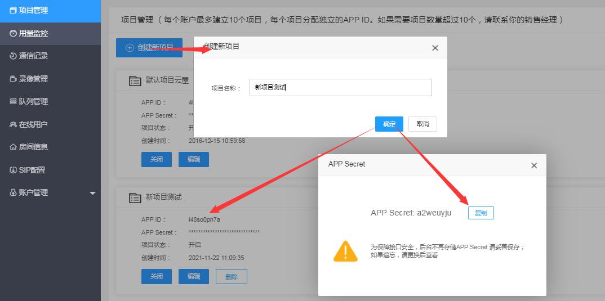
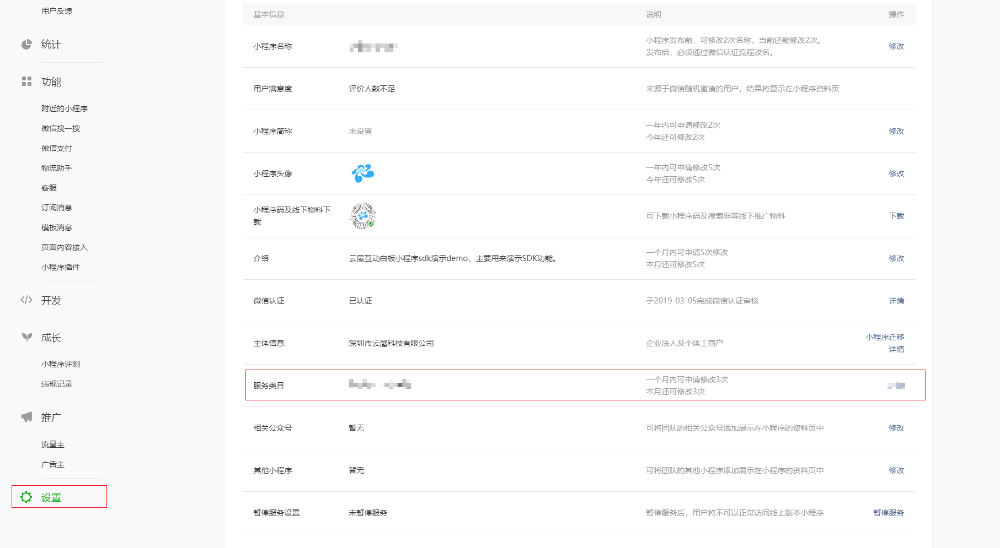
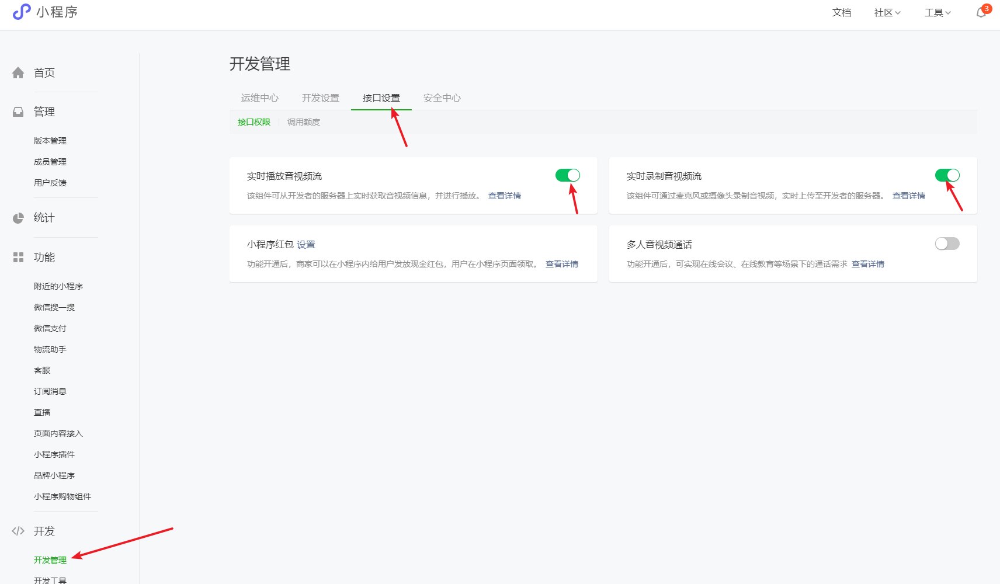

# 准备工作

## 帐号申请

[点此注册](https://sdk.cloudroom.com/mgr_sdk/register.html) 一个账号，或者联系商务代为开通，或在网站咨询客服。

<h2 id=getappid>创建项目</h2>

可以在 [管理平台](https://sdk.cloudroom.com/mgr_sdk/) 中创建新的项目（系统有一个默认项目，可以直接使用），如下图：

为了保障接口安全，后台不再显示App Secret，所以请在创建项目成功显示App Secret时妥善保存好。 如果遗忘只能如下图更换App Secret：

<h2 id=fireWallSettings>防火墙开通</h2>

在使用云屋SDK提供的相关服务之前，您需要打开下面这些特定的端口：

<table border=0 cellpadding=0 cellspacing=0 style='border-collapse:collapse;table-layout:fixed;'>
    <thead>
        <tr >
            <th style='width:12%;text-align:center'>端口</th>
            <th style='width:25%;text-align:center'>功能说明</th>
            <th style='width:23%;text-align:center'>Windows, Linux, Android, iOS, macOS, 网页插件</th>
            <th style='width:10%;text-align:center'>H5 SDK</th>
            <th style='width:10%;text-align:center'>小程序SDK</th>
            <th style='width:10%;text-align:center'>直播观看SDK</th>
            <th style='width:10%;text-align:center'>后台管理页面</th>
        </tr>
    </thead>
    <tbody>
    <tr>
        <td>TCP 2725</td>
        <td style='text-align:center'>后台管理服务端口</td>
        <td></td>
        <td></td>
        <td></td>
        <td></td>
        <td style='text-align:center'>√</td>
    </tr>
    <tr>
        <td>TCP 2726</td>
        <td style='text-align:center'>https服务端口 (SDK缺省使用https)
        </td>
        <td style='text-align:center'>√</td>
        <td style='text-align:center'>√</td>
        <td style='text-align:center'>√</td>
        <td style='text-align:center'>√</td>
        <td style='text-align:center'></td>
    </tr>
    <tr>
        <td>TCP 2728</td>
        <td style='text-align:center'>信令服务端口</td>
        <td style='text-align:center'>√</td>
        <td style='text-align:center'></td>
        <td style='text-align:center'></td>
        <td style='text-align:center'></td>
        <td style='text-align:center'></td>
    </tr>
    <tr>
        <td>TCP 1935</td>
        <td style='text-align:center'>服务器音视频流端口(rtmp)</td>
        <td></td>
        <td></td>
        <td style='text-align:center'>√</td>
        <td style='text-align:center'>√</td>
        <td style='text-align:center'></td>
    </tr>
    <tr>
        <td>UDP 2698</td>
        <td style='text-align:center'>服务器音视频流端口</td>
        <td style='text-align:center'>√</td>
        <td></td>
        <td></td>
        <td></td>
        <td></td>
    </tr>
    <tr>
        <td>UDP 2699</td>
        <td style='text-align:center'>服务器音视频流端口(H5)</td>
        <td></td>
        <td style='text-align:center'>√</td>
        <td></td>
        <td></td>
        <td></td>
    </tr>    
    </tbody>
</table>

## SDK下载
- [点此下载](download.md#sdk下载地址) 

## 环境测试
可直接运行SDK包里的案例，因小程序会强制对https校验，测试时请注意以下事项  
 * 若使用云屋公有云环境，请设置服务器地址为 sdk.cloudroom.com
 * 若使用自建私有云环境，可使用http协议测试，即默认2727端口，若做了端口映射请自行调整，服务器地址格式为：http://IP:2727  
 小程序上线后不支持http协议，上线前需要升级为https协议  
 * 因域名不合法小程序中可能会报错，请在设置中开启调试模式
 * 使用线上版本小程序在开启调试后不支持第三方服务器地址测试
 * 更多限制参考[小程序网络说明](https://developers.weixin.qq.com/miniprogram/dev/framework/ability/network.html)，以官方文档为准

## 使用前注意事项
  * 个人用户的小程序无法使用小程序音视频互动功能,请使用其他方式注册小程序
  * 因为微信存在一定的限制，请勿使用测试号进行测试及开发工作
  * 小程序涉及多方通话，需要企业实体拥有对应资质并且在小程序后台中通过类目审核 [参考支持的类目](https://developers.weixin.qq.com/miniprogram/dev/component/live-pusher.html) [服务类目审核文件](https://developers.weixin.qq.com/miniprogram/product/material/)

## 开发前准备工作（必须完成）

1. 小程序公众平台中已完成微信认证
1. 小程序公众平台中选择对应的[服务类目](https://developers.weixin.qq.com/miniprogram/dev/component/live-pusher.html)

1. 小程序公众平台中开启实时播放音视频流、实时录制音视频流

1. 小程序公众平台中配置服务器域名，参考[云屋公有云服务配置](/wxconfig.md#public)或者[私有服务器配置](/wxconfig.md#private)