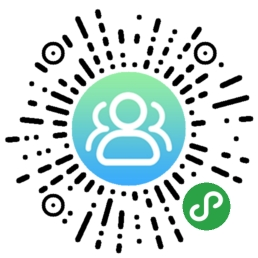
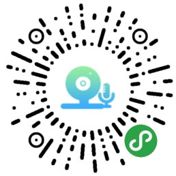
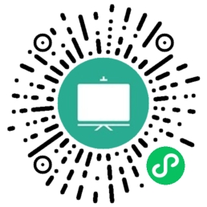

# SDK下载及Demo演示
## 在线Demo体验
请使用微信扫描下列二维码  

|云屋云会议Demo  |云屋云呼叫Demo |互动白板Demo|
|----- |----- |----- |
||  ||

## SDK下载地址

* [点此下载](https://sdk.cloudroom.com/pages/download#sdk) 小程序SDK  

##  SDK包目录结构

```c
├─CRSDK                            // SDK包，将该文件夹拷贝到项目中
│  ├─CR_Miniapp_SDK.min.js           // SDK
│  │
│  ├─CR_Miniapp_SDK.min.js.map       // SDK映射文件，便于快速定位SDK报错位置。非必要
│  │
│  └─components                      // SDK组件
│      ├─CRAudioPlayer                 // 音频拉流组件
│      ├─CRVideoPlayer                 // 视频拉流组件
│      ├─CRVideoPusher                 // 音视频推流组件
│      ├─CRScreenMarkV4                // 屏幕共享标注组件
│      ├─CRWhiteBoard                  // 白板标注组件
│      └─video-custom                  // 视频自定义组件，定制需求在此开发（不需要更新）
│
├─meetingDemo                        // 云屋云会议演示-meetingDemo
│   ├─pages                            // 项目页面
│   │   ├─chat                           // 聊天页面
│   │   ├─login                          // 首页，登录页面
│   │   ├─meeting                        // 视频会议页面
│   │   ├─option                         // 选项页面
│   │   └─setting                        // 设置页面
│   │
│   └─utils
│       └─CRSDK                          // 导入SDK目录到项目中
│
├─videoCallDemo                      // 云屋云呼叫演示-videoCallDemo
│   ├─components                       //自定义组件
│   │   └─myModal
│   │
│   ├─pages                            // 项目页面
│   │   ├─login                          // 登录页面
│   │   ├─queue                          // 队列页面
│   │   ├─setting                        // 设置页面
│   │   └─videoCall                      // 视频呼叫页面
│   │
│   └─utils
│       └─CRSDK                          // 导入SDK目录到项目中
│
└─whiteBoardDemo                     // 互动白板演示-whiteBoardDemo
    ├─pages                            // 项目页面
    │   ├─login                          // 首页，登录页面
    │   ├─whiteBoard                     // 互动白板页面
    │   └─setting                        // 设置页面
    │
    └─utils
        └─CRSDK                          // 导入SDK目录到项目中
```
## 版本更新记录
### 2021-09-15 V1.3.17.2
1. 新增白板demo，SDK新增白板相关接口
1. 增加主功能区、子功能区相关接口
### 2021-05-31 V1.3.16.5
1. 修复开关麦克风导致声音断续问题
1. 修复观看屏幕共享某些原因导致黑屏后不可恢复的问题
### 2020-12-18 V1.3.13.13
1. 新增服务器选优机制
1. 修复IOS第二次观看屏幕共享标注不显示的问题
### 2020-12-7 V1.3.13.10
1. 修复安卓被微信语音打断时，媒体共享、屏幕共享卡在最后一帧的问题