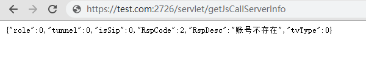

# 小程序后台配置

## 云屋公有云服务配置 ${#public}

1. 打开并登录小程序后台依次点击开发-开发设置-服务器域名，再点击修改

1. 验证完管理员后，弹出配置框 

1. 在"request合法域名"中添加下列域名
    * https://sdk.cloudroom.com;
1. 在"socket合法域名"中添加下列域名
    * wss://ali16.cloudroom.com:443;
    * wss://ali8.cloudroom.com:443;
    * wss://hw2.cloudroom.com:443;
    * wss://ali9.cloudroom.com:543;
    * wss://tx1.cloudroom.com:443;
    * wss://acc1.cloudroom.com:443;
    * wss://acc2.cloudroom.com:443;
    * wss://acc3.cloudroom.com:443;
    * wss://acc4.cloudroom.com:443;
    * wss://acc5.cloudroom.com:443;
    * wss://acc6.cloudroom.com:443;
    * wss://acc7.cloudroom.com:443;
    * wss://acc8.cloudroom.com:443;
    * wss://acc9.cloudroom.com:443;
1. 完成后如下图所示，点击保存并提交即可

## 私有云服务配置 ${#private}

1. 配置SSL证书及域名解析
1. 假如域名是"test.com",私有云https服务默认端口为2726，如果做了端口映射以下请根据实际的端口进行配置。
1. 使用浏览器访问云屋任意接口测试证书是否正确 (可使用https://test.com:2726/servlet/getJsCallServerInfo) 
    1. 如下图，正常访问，提示账号不存在，说明配置正确
    
    1. 如下图，SSL证书错误，可使用[SSL检测工具](https://myssl.com/ssl.html)检测
    
1. 以上确认没问题后进行一下操作
    1. 打开并登录小程序后台依次点击开发-开发设置-服务器域名，再点击修改 
    
    1. 验证完管理员后，弹出配置框
    
    1. 在"request合法域名"中添加下列域名
        * https://test.com:2726
    1. 在"socket合法域名"中添加下列域名
        * wss://test.com:2726
    1. 完成后如下图所示，点击保存并提交即可
    