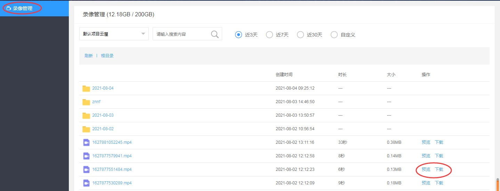

# 云端录制

## 功能介绍

在服务器上对房间内的音视频、影音共享、屏幕共享等通讯内容进行录制，支持自定义录制内容和布局，录制文件在服务器保存，可以通过[WEB API](https://sdk.cloudroom.com/sdkdoc/webapi/)下载和删除


<h2 id=record_enbale> 1.开通云端录制服务</h2>

- 请确保您已成功[注册](https://sdk.cloudroom.com/mgr_sdk/register.html)了一个帐号。</br>
- 请联系商务为对应帐号开通“云端录制服务”。

<h2 id=record_startCloudMixer> 2.开始云端录制</h2>

- 录制左右布局示例图:


- 调用接口：

```js
var mixerID = "1";
var recordWidth = 640; //录制画布的宽高
var recordHeight = 360;

var SWidth = recordWidth; //图像占据宽高
var rate = 16/9; //假设图像比例为16：9
var SHeight = recordWidth/rate;

var mutiMixerCfgs; //配置混图器编码参数
var mutiMixerContents; //配置混图器内容
var mutiMixerOutputs; //配置混图器输出

    mutiMixerCfgs = [
        {
            "id": mixerID,
			"cfg":  {"width":recordWidth,
                    "height":recordHeight,
                    "frameRate":8,
                    "bitRate":350000,
                    "defaultQP":28,
                    "gop":120
                    };
        }
    ];


//配置混图器内容： 左右布局(示例图如下)，左边为user1的1号摄像头， 右边为user2的1号摄像头
var mixerContents = [];
var leftCon = {}, rightCon = {};  //左右视频图像的内容配置
leftCon["type"] = 0; //0： 录制类型为视频
leftCon["left"] = 0 ;
leftCon["top"] = (recordHeight-sHeight/2)/2;   //视频图像垂直居中
leftCon["width"] = sWidth/2;
leftCon["height"] =  sHeight/2;
leftCon["param"] = {"camid":"user1.1"};
leftCon["keepAspectRatio"] = 1;
mixerContents.push(leftCon);

rightCon["type"] = 0; //0： 录制类型为视频
rightCon["left"] = sWidth/2;
rightCon["top"] = (recordHeight-sHeight/2)/2;   //视频图像垂直居中
rightCon["width"] = sWidth/2;
rightCon["height"] =  sHeight/2;
rightCon["param"] = {"camid":"user2.1"};
rightCon["keepAspectRatio"] = 1;
mixerContents.push(rightCon);
							 
      
    mutiMixerContents = [
        {
            "id": mixerID,
            "content": mixerContents
        }
    ];
    mutiMixerOutputs = [ 
        {
            "id": mixerID,
			"output": [
				{"type":0,
				"filename":"/2019-03-19/" + "2019-03-19-10-30-30_Web.mp4"}   //配置录制的文件名
				]
        }
    ];

    var rst = CRVideo_StartSvrMixer(mutiMixerCfgs, mutiMixerContents, mutiMixerOutputs);
    if(rst != CRVideo_NOERR){
        console.log("开启 云端录制 出错！ 错误码："+ rst);
        return;
    }
```


- 回调通知：

```js
//云端录制状态变化通知 
CRVideo_SvrMixerStateChanged.callback = function(state, err, operatorID)
{
	console.log("CRVideo_SvrMixerStateChanged, state="+state+",  err:"+err+",    operatorID"+ operatorID);
}

```

相关API请参考:
- [CRVideo_StartSvrMixer](API.md#CRVideo_StartSvrMixer)
- [CRVideo_SvrMixerStateChanged](API.md#CRVideo_SvrMixerStateChanged)

相关结构定义请参考：
- [CRVideo_MutiMixerCfgsObj](TypeDefinitions.md#CRVideo_MutiMixerCfgsObj)
- [CRVideo_MutiMixerContentsObj](TypeDefinitions.md#CRVideo_MutiMixerContentsObj),
- [CRVideo_MutiMixerOutputsObj](TypeDefinitions.md#CRVideo_MutiMixerOutputsObj)	

 
<h2 id=svrMixerOutputInfo> 3.云端录制文件信息变化通知</h2>

录制过程中都会触发此事件。在此可以实时获得录制状态、录制文件当前的时长、大小，以及录制异常等信息。

- 回调通知：

```js
//云端录制文件信息变化通知
CRVideo_SvrMixerOutputInfo.callback = function(outputInfo)
{
	console.info("CRVideo_SvrMixerOutputInfo",outputInfo);
}	
```

相关API请参考:
- [CRVideo_SvrMixerOutputInfo](API.md#CRVideo_SvrMixerOutputInfo)

相关结构定义请参考：
- [CRVideo_MixerOutputInfoObj](TypeDefinitions.md#CRVideo_MixerOutputInfoObj)


<h2 id=record_updateSvrMixerContent> 4.更新云端录制内容</h2>

- 更新成画中画布局示例图:


- 接口调用：

```js

var mixerID = "1";
var recordWidth = 640; //录制画布的宽高
var recordHeight = 360;

var SWidth = recordWidth; //图像占据宽高
var rate = 16/9; //假设图像比例为16：9
var SHeight = recordWidth/rate;

//更新录制布局为：画中画

//混图器内容：画中画布局(示例图如下， 底层640*360， 上层160*90)，底层为user1的1号摄像头， 上层为user2的1号摄像头
var mixerContents = [];
var leftCon = {}, rightCon = {};  //左右视频图像的内容配置
leftCon["type"] = 0; //0： 录制类型为视频
leftCon["left"] = 0 ;
leftCon["top"] = 0;   //视频图像垂直居中
leftCon["width"] = sWidth;
leftCon["height"] =  sHeight;
leftCon["param"] = {"camid":"user1.1"};
leftCon["keepAspectRatio"] = 1;
mixerContents.push(leftCon);

rightCon["type"] = 0; //0： 录制类型为视频
rightCon["left"] = sWidth - 160 - 5;  //上层图像距离最右边 5px
rightCon["top"] = sHeight - 90 -5;   //上层图像距离最下边 5px
rightCon["width"] = 160;
rightCon["height"] = 90;
rightCon["param"] = {"camid":"user2.1"};
rightCon["keepAspectRatio"] = 1;
mixerContents.push(rightCon);
    
var mutiMixerContents = [{
	"id": mixerID,
	"content": mixerContents
}];

CRVideo_UpdateSvrMixerContent(mutiMixerContents);

```

相关API请参考:
- [CRVideo_UpdateSvrMixerContent](API.md#CRVideo_UpdateSvrMixerContent)


<h2 id=record_getSvrMixerState> 5.获取云端录制状态</h2>


- 接口调用：

```js
//获取云端录制状态
var state = CRVideo_GetSvrMixerState()
```

相关API请参考:
- [CRVideo_GetSvrMixerState](API.md#CRVideo_GetSvrMixerState)

相关结构定义请参考：
- [CRVideo_MIXER_STATE](Constant.md#CRVideo_MIXER_STATE)


<h2 id=record_stopSvrMixer> 6.停止云端录制</h2>

停止云端录制后，也会触发事件[CRVideo_SvrMixerStateChanged](API.md#CRVideo_SvrMixerStateChanged)

- 接口调用：
```js
CRVideo_StopSvrMixer();
```

相关API请参考:
* [CRVideo_StopSvrMixer](API.md#CRVideo_StopSvrMixer)

<h2 id=record_getFile> 7.获取录像</h2>

录像停止后，录像文件会开始上传到录像文件存储服务器中（可关注[CRVideo_SvrMixerOutputInfo](API.md#CRVideo_SvrMixerOutputInfo)通知，得到上传完成事件）。 

可以通过[WEB API](http://sdk.cloudroom.com/sdkdoc/webapi/)进行录像文件查询、下载和删除等处理。

也可以登录[管理后台](https://sdk.cloudroom.com/mgr_sdk/)，在管理页面上回放和下载录像：


