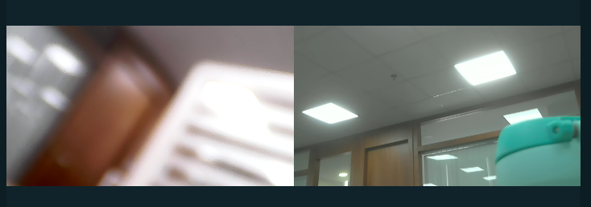

# 本地直播推流

## 功能简介

用于1个或多个主播实时连麦互动，然后图像和声音将在SDK本地进行混合，然后直接向CDN流媒体服务器推流，直播观众就可以获取RTMP或HLS流观看直播了。

<h2 id=live_createLocMixer>1.创建混图器</h2>


- 接口调用：

```csharp
//混混图器编号:图器唯一标识
string mixerID = "1";
//混图器规格配置:720P,帧率15，其他为默认配置
string mixerCfg = "[{\"width\"}:1280, \"height\":720, \"frameRate\":15]";

//混图器内容配置：混图类型为摄像头，混图时图像保持比例，左右布局，左边为user1的1号摄像头， 右边为user1的2号摄像头
string mixerContent = "[\
{\"type\":0,\"keepAspectRatio\":1,\"left\":5,\"top\":181,\"width\":633,\"height\":356,\"param\":{\"camid\":\"usr1.1\"}},\
{\"type\":0,\"keepAspectRatio\":1,\"left\":642,\"top\":181,\"width\":633,\"height\":356,\"param\":{\"camid\":\"usr2.1\"}}\
]";

axVideoSDK.createLocMixer(mixerID, mixerCfg, mixerContent);

```

<p id=layout style="font-weight:normal;">左右布局配置示例图:  </p>

</br>
混图器左右布局实例，左边为user1的1号摄像头， 右边为user2的1号摄像头

相关API请参考：
* [createLocMixer](API.md#createLocMixer)


<h2 id=live_addLocMixerOutput>2.开启直播推流</h2>

添加混图器输出后，会触发locMixerOutputInfo通知.如果输出异常，将自动停止推流。

- 接口调用：

```csharp
//添加直播推流
string mixId = "1";
//输出配置：输入为摄像头，内容保存到路径为D:/1.mp4的文件中
string mixerOutput = "[{\"type\":0,\"filename\":\"D:/1.mp4\"}]";
axVideoSDK.addLocMixerOutput(mixId, mixerOutput);
```
相关API请参考：
* [addLocMixerOutput](API.md#addLocMixerOutput)
* [locMixerOutputInfo](API.md#locMixerOutputInfo)


<h2 id=live_locMixerOutputInfo>3.直播推流事件处理</h2>

录制过程中都会触发此事件。在此可以实时获得录像文件当前的时长、大小，以及录像文件异常等信息。


- 回调通知：

```csharp
//录制文件、直播信息通知
void Meeting_locMixerOutputInfo(object sender, ICloudroomVideoMeetingEvents_locMixerOutputInfoEvent e)
{
    MixerOutputInfoObj obj = JsonConvert.DeserializeObject<MixerOutputInfoObj>(e.p_outputInfo);
    if (obj.state)
    {
	     ...
       //状态处理
    }
}

```

相关API请参考：
* [locMixerOutputInfo](API.md#locMixerOutputInfo)


<h2 id=live_updateLocMixerContent>4.更新图像内容</h2>

- 接口调用：

```csharp
//混图器编号
string mixerID = "1";
//混图器内容： 左右布局，混图类型为摄像头，混图时图像保持比例，左边为user1的1号摄像头， 右边为user1的2号摄像头
sring mixerContent ="[\
{\"type\":0,\"keepAspectRatio\":1,\"left\":5,\"top\":181,\"width\":633,\"height\":356,\"param\":{\"camid\":\"usr1.1\"}},\
{\"type\":0,\"keepAspectRatio\":1,\"left\":642,\"top\":181,\"width\":633,\"height\":356,\"param\":{\"camid\":\"usr2.1\"}}\
]";

//更新混图器内容
axVideoSDK.updateLocMixerContent(mixerID, mixerContent);

```
上述混图器内容左右布局，详见[左右布局](#layout)

相关API请参考：
* [updateLocMixerContent](API.md#updateLocMixerContent)


<h2 id=live_destroyLocMixer>5.结束</h2>


- 接口调用：

```csharp
//混图器编号
string mixerID = "1";
//消毁混图器， 各输出自动结束
axVideoSDK.destroyLocMixer(mixerID);

```

相关API请参考:
* [destroyLocMixer](API.md#destroyLocMixer)
