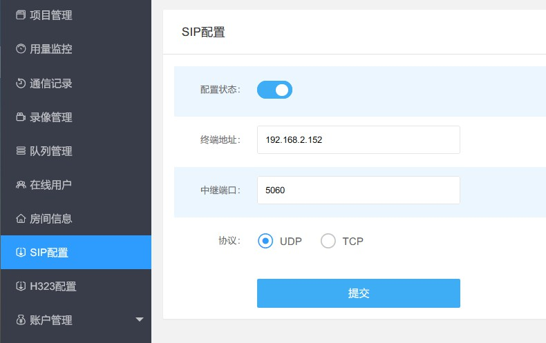
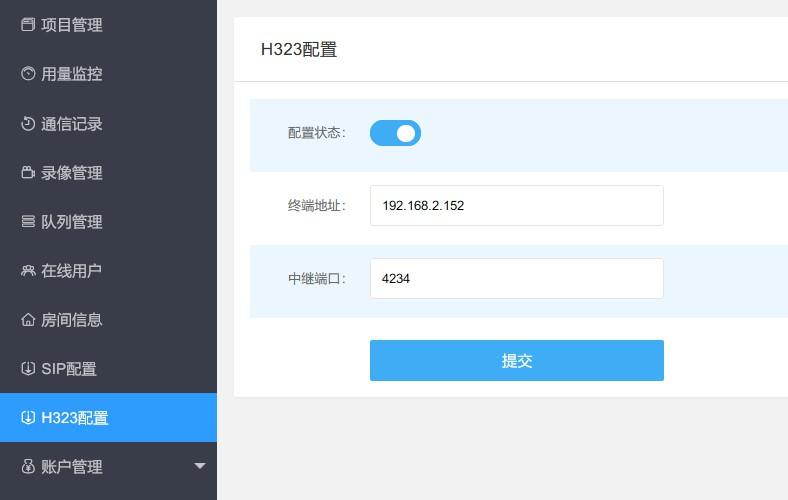
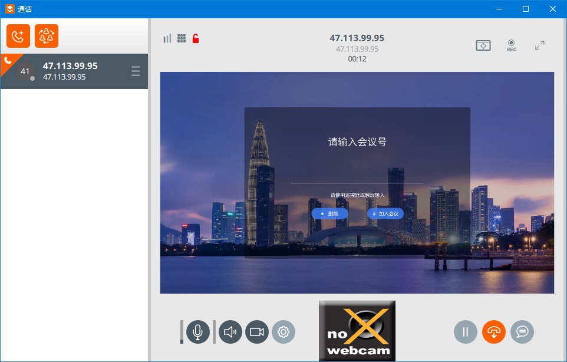
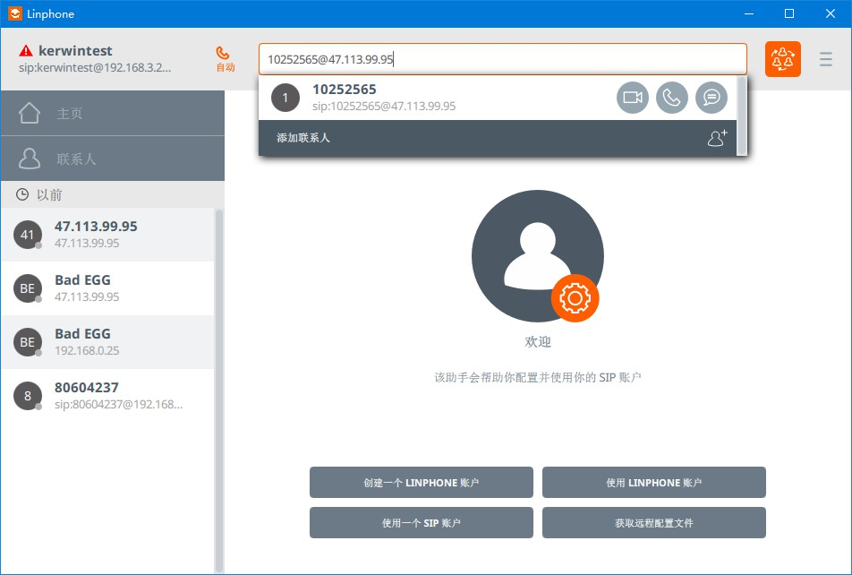
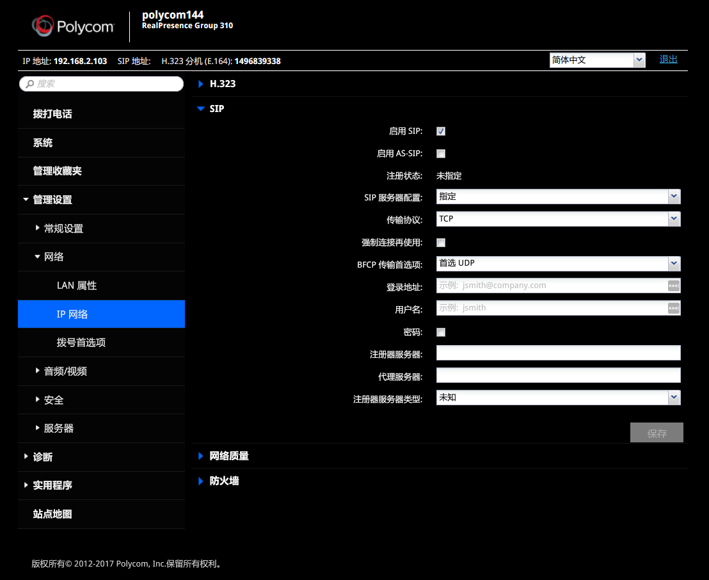
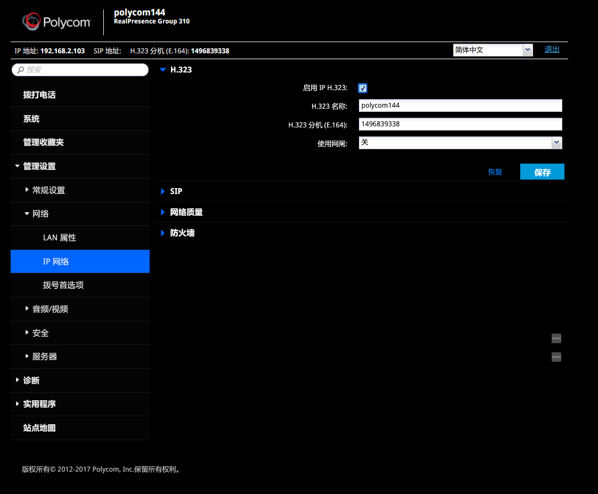
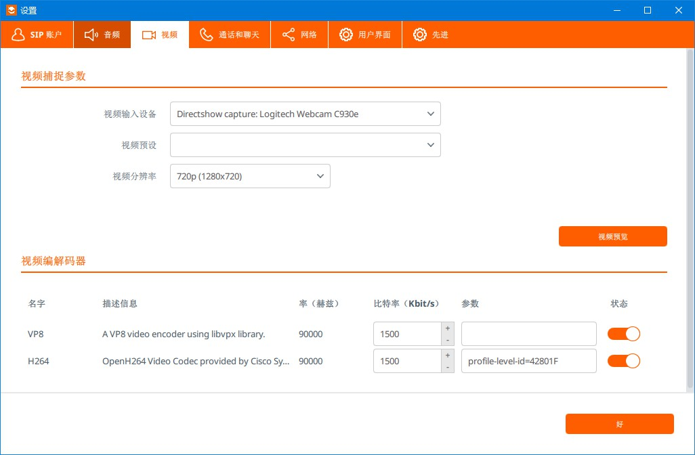

# SIP/H.323设备支持

## 功能介绍

云屋SDK支持通过SIP和H.323标准协议与硬件视频会议系统或PSTN电话系统对接，可支持以下几种场景：

1. SDK呼叫单个对接端：从SDK端向对接端发起呼叫，对接端用户应答后与SDK一起进入房间；
1. SDK邀请多个对接端：SDK端先进入房间，然后向一个或多个对接端用户发起邀请，被邀请用户接受邀请后加入该房间；
1. 对接端呼叫SDK：SDK端在线，对接端向SDK端发起呼叫，SDK端应答后与对接端一起加入房间；
1. 对接端直接加入房间：SDK房间提前建好，对接端呼叫房间号后加入房间； 

以上对接端可以是支持SIP/H.323的硬件终端、传统电话、MCU会议


<h2 id=svrConfig>功能开通</h2>

1. 联系商务开通SIP/H.323对接功能，或在网站咨询客服。

1. 登录 [SDK后台](https://sdk.cloudroom.com/mgr_sdk/login.html) ，选择SIP配置/H.323配置，打开配置开关；如需配置中继模式，则填入对应的终端地址、端口号、协议（且SIP设备支持选择协议）。

- SIP配置：

- H.323配置：



<h2 id=callSipH323>SDK呼叫单个对接端</h2>

:::danger

注意：
1. 当用户A呼叫SIP/H.323设备时，对端设备需要在线，如果呼叫的是E.164号码，需要对应设备已注册，否则被呼叫端无法收到被呼叫的消息；设备收到呼叫消息后，根据其自身设置的应答机制，会自动进入房间或在按下接听后进入房间。
1. 如果在 [功能开通](#svrConfig) 的"SIP配置"或者"H.323配置"界面配置了中继地址，呼叫时不需要填写对端设备IP，直接填写"sip:号码"或者"h323:号码"即可

:::


- 调用接口：

```csharp
 
//被呼叫的SIP/H.323设备的IP或E.164号码，以sip:或h323:为前缀
string calledUID = "sip:192.168.0.10";   // 呼叫IP为192.168.0.10的SIP设备
// string calledUID = "h323:149689338";  // 呼叫E.164号码为14989338的H.323设备
string strMeeting = "{\"Meeting\":{\"ID\":xxx}}";
axVideoSDK.call(calledUID, strMeeting, "", "");
 
```

- 回调通知：

```csharp
 
//呼叫操作成功响应
void callSuccess(object sender, ICloudroomVideoMgrEvents_callSuccessEvent e){
  Console.WriteLine("callSuccess:" + e.p_callID);
}

// 呼叫操作失败响应
void callFailed(object sender, ICloudroomVideoMgrEvents_callFailEvent e){
    Console.WriteLine("callFailed, error:" + e.p_sdkErr + ", callID:" + e.p_callID);
}
 
```

呼叫相关API请参考:
* [call](API.md#call)
* [callSuccess](API.md#callSuccess)
* [callFailed](API.md#callFail)


<h2 id=inviteSipH323>SDK邀请多个对接端</h2>

:::danger

注意：
1. 仅当用户A已经进入会议，才可以邀请SIP/H.323设备。
1. 当用户A邀请SIP/H.323设备时，对应设备需要在线，如果呼叫的是E.164号码，需要对应设备已注册，否则被呼叫端无法收到被呼叫的消息；设备收到呼叫消息后，根据其自身设置的应答机制，会自动进入房间或在按下接听后进入房间。
1. 如果在 [功能开通](#svrConfig) 的"SIP配置"或者"H.323配置"界面配置了中继地址，邀请时不需要填写对端设备IP，直接填写"sip:号码"或者"h323:号码"即可

:::

- 调用接口：

```csharp
 
//被邀请的SIP/H.323设备的IP或E.164号码，以sip:或h323:为前缀
string inviteeUsrID = "sip:192.168.0.10";   // 邀请IP为192.168.0.10的SIP设备
// string inviteeUsrID = "h323:149689338";  // 邀请E.164号码为14989338的H.323设备
string usrExtDat = "{\"meeting\":{\"ID\":xxx}}";
string inviteID = axVideoSDK.invite(inviteeUsrID, usrExtDat, inviteeUsrID);
 
```

- 回调通知：

```csharp
 
//邀请发送成功
void inviteSuccess(object sender, ICloudroomVideoSDKEvents_inviteSuccessEvent e)
{
  //等待被邀请方应答/拒绝，或邀请超时
}

//邀请发送失败
private void inviteFail(object sender, ICloudroomVideoSDKEvents_inviteFailEvent e)
{
  //邀请发送失败，弹出提示框等处理
}

//通知邀请被接受
private void notifyInviteAccepted(object sender, ICloudroomVideoSDKEvents_notifyInviteAcceptedEvent e)
{
  //邀请被接受，等待被邀请方入会等处理
}

//通知邀请被拒绝
private void notifyInviteRejected(object sender, ICloudroomVideoSDKEvents_notifyInviteRejectedEvent e)
{
  //邀请被拒绝，弹出提示框等处理
}
 
```

相关API请参考:

* [inviteSuccess](API.md#inviteSuccess)
* [inviteFail](API.md#inviteFail)
* [notifyInviteAccepted](API.md#notifyInviteAccepted)
* [notifyInviteRejected](API.md#notifyInviteRejected)


<h2 id=sipH323Called>对接端呼叫SDK</h2>

被呼叫的SDK端收到被他人呼叫通知，具体请参考 [SDK被呼叫](call.md#called) 部分


<h2 id=sipH323EnterMeeting>对接端直接加入房间</h2>

下面以 Linphone 为例演示直接加入房间的方法：

1. 二次拨号方式，呼叫 sip:47.113.99.95 或者 h323:47.113.99.95 ，呼通后根据界面提示输入房间号，再输入"#"键以进入对应房间

- 拨号界面

- 输入房间号界面


2. 直接呼叫房间号方式，呼叫 10252565@47.113.99.95 ，进入对应房间




<h2 id=endpointConfig>配置终端</h2>

下面以宝利通硬终端和Linphone软终端为例，说明终端的配置方法。

### 宝利通终端

- 登录web管理页面，左侧导航栏选择管理设置→网络→IP网络

- 启用SIP呼叫，注：如果在SDK后台配置SIP时选择了协议，此处应选择一致的传输协议


- 启用H.323呼叫：


### Linphone软终端

- 打开偏好设置，选择视频，在下方添加H264解码器并确保开启


