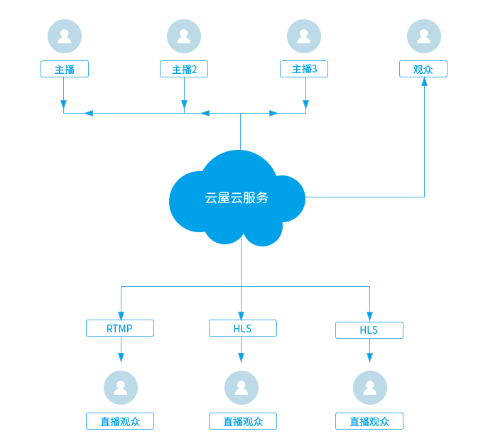

# 云端直播推流

## 功能简介

用于多个主播实时连麦互动。技术实现上，我们会把房间里多个主播的音视频在服务器合成一路流后推流到CDN流媒体服务器，直播观众可以获取RTMP或HLS流观看直播。
<p id=layout style="font-weight:normal;">互动直播架构图:  </p>
</img>

<h2 id=addr> 1.创建直播间并获得推流地址</h2>

- 创建直播间请参见：[Web API 创建直播](https://sdk.cloudroom.com/sdkdoc/live/createLiveAPI.html)。
- 获取直播推流地址请参见：[Web API 获取推流地址](https://sdk.cloudroom.com/sdkdoc/live/queryLiveAPI.html)。


<h2 id=record_startCloudMixer> 2.开始互动直播</h2>

<p id=layout style="font-weight:normal;">左右布局示例图:  </p>


- 调用接口：

```csharp

//配置混图器编码参数：1280*720,  15帧
string cloudMixerCfg =
"{\
    \"mode\": 0,\
    \"videoFileCfg\": {\
        \"svrPathName\": \"/2021-09-24/2021-09-24_13-47-41_Win32_73542046.mp4\",\
        \"vWidth\": 1280,\
        \"vHeight\": 720,\
        \"vFps\": 15,\
        \"layoutConfig\": [\
            {\
                \"type\": 0,\
                \"top\": 180,\
                \"left\": 0,\
                \"width\": 640,\
                \"height\": 360,\
                \"keepAspectRatio\": 1,\
                \"param\": {\"camid\": \"Usr1.-1\"}\
            },\
            {\
                \"type\": 0,\
                \"top\": 180,\
                \"left\": 640,\
                \"width\": 640,\
                \"height\": 360,\
                \"keepAspectRatio\": 1,\
                \"param\": {\"camid\": \"Usr2.-1\"}\
            }\
        ]\
    }\
}"

string mixerID = axVideoSDK.createCloudMixer(cloudMixerCfg);
 if (mixerID.Length <= 0) {
    //开启云端直播出错, 
	int err = axVideoSDK.getCreateCloudMixerLastErr();
    ...
}

```

相关API请参考:</br>
[createCloudMixer](API.md#createCloudMixer)</br>
[getCreateCloudMixerLastErr](API.md#getCreateCloudMixerLastErr)</br>


<h2 id=record_updateCloudMixerContent> 3.更新互动直播内容</h2>

<p id=layout_overlap style="font-weight:normal;">更新成画中画布局示例图:  </p>


- 接口调用：

```csharp

string cloudMixerCfg =
"{\
    \"videoFileCfg\": {\
        \"layoutConfig\": [\
            {\
                \"type\": 0,\
                \"top\": 0,\
                \"left\": 0,\
                \"width\": 1280,\
                \"height\": 720,\
                \"keepAspectRatio\": 1,\
                \"param\": {\"camid\": \"Usr1.-1\"}\
            },\
            {\
                \"type\": 0,\
                \"top\": 265,\
                \"left\": 475,\
                \"width\": 160,\
                \"height\": 90,\
                \"keepAspectRatio\": 1,\
                \"param\": {\"camid\": \"Usr2.-1\"}\
            }\
        ]\
    }\
}"


axVideoSDK.updateCloudMixerContent(mixerID, cloudMixerCfg);

```

相关API请参考:</br>
[updateCloudMixerContent](API.md#updateCloudMixerContent)</br>


<h2 id=record_stopCloudMixer> 4.停止互动直播</h2>

停止云端直播推流后，会触发事件[cloudMixerStateChanged](API.md#cloudMixerStateChanged)

- 接口调用：
```csharp

axVideoSDK.destroyCloudMixer();
```

相关API请参考:</br>
[destroyCloudMixer](API.md#destroyCloudMixer)</br>
[cloudMixerStateChanged](API.md#cloudMixerStateChanged)</br>


<h2 id=record_vod> 5.回放点播</h2>

通过 [云屋点播API](https://sdk.cloudroom.com/sdkdoc/live/db_summary.html)回放点播。

