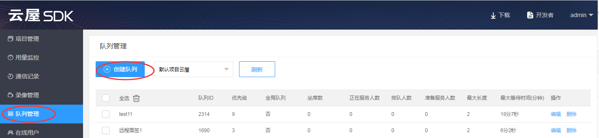

# 排队

## 功能介绍

在呼叫中心的业务场景下，有多个客户呼叫进来，有多个坐席提供服务，简单的一对一呼叫无法满足业务需求。此时可以使用我们的排队功能，客户不再直接呼叫某个坐席，而是呼叫到一个坐席队列，由系统自动给客户分配一个空闲的坐席。
- 多个坐席可以服务于一个队列，客户排队这个队列时，系统会自动分配一个空闲坐席来提供服务。
- 一个坐席可以同时服务多个队列，优先服务高优先级队列里的客户，队列优先级相同时优先服务最早排队的客户。
- 业务高峰期没有空闲的坐席时，客户将在队列中排队等待，当有坐席空闲时，将为最早排队的客户提供服务。
- 同一队列的坐席可以配置不同的坐席优先级，队列中的客户优先由空闲的高优先级的坐席来提供服务。


:::danger

注意：在登录成功后才可以使用排队功能。

:::


<h2 id=createQueue>1.创建队列</h2>

可以通过两种方式创建队列：

- 第一种是[登录云屋SDK后台](https://sdk.cloudroom.com/mgr_sdk/login.html)并创建。如下图：
 

- 第二种是通过[Web API](/sdk/document/queue/queue_add?platform=serverside)创建。


<h2 id=initQueue>2.初始化队列</h2>

在登录成功后，初始化队列信息

- 调用接口

```oc
// 设置队列回调
[[CloudroomQueue shareInstance] setQueueCallback:self];
```

- 回调通知

```oc
//可在登录成功后初始化队列数据
- (void)loginSuccess:(NSString *)usrID cookie:(NSString *)cookie {
	// 初始化专家坐席用户队列
	[[CloudroomQueue shareInstance] initQueueDat:@""];
}

//队列初始化响应
- (void)initQueueDatRslt:(CRVIDEOSDK_ERR_DEF)errCode cookie:(NSString *)cookie {
	// TODO Auto-generated method stub
	NSMutableArray <QueueInfo *> * queueInfos = [[CloudroomQueue shareInstance] getQueueInfo];
}
```
相关API请参考:
+ [initQueue](Apis.md#initQueue)
+ [initQueueDatRslt](Apis.md#initQueueDatRslt)
+ [getAllQueueInfo](Apis.md#getAllQueueInfo)

相关结构定义请参考:
+ [VideoSessionInfo](TypeDefinitions.md#VideoSessionInfo)
+ [QueueInfo](TypeDefinitions.md#QueueInfo)


<h2 id=getQueue>3.获取队列信息</h2>


在初始化队列成功后，才可以使用获取队列信息。并且可以多次获取。

- 调用接口：

```oc
//获取队列信息
NSMutableArray <QueueInfo *> * queueInfos = [[CloudroomQueue shareInstance] getAllQueueInfo];

```

<h2 id=servicesOpr>4.1坐席：服务队列</h2>


- 调用接口：

```oc
//开始服务某个队列(可以多次调用，开启对多个队列的服务) .
[[CloudroomQueue shareInstance] startService:queID cookie:@""];

//停止服务某个队列
[[CloudroomQueue shareInstance] stopQueuing:queID];

//获取服务的所有队列
NSMutableArray <NSNumber *> *queIDs =  [[CloudroomQueue shareInstance] getServiceQueues];

```

- 回调通知：

```  oc
//开始队列服务结果
- (void)startServiceRslt:(int)queID errCode:(CRVIDEOSDK_ERR_DEF)errCode cookie:(NSString *)cookie {
    // TODO Auto-generated method stub
}
	
//停止队列服务结果
- (void)stopServiceRslt:(int)queID errCode:(CRVIDEOSDK_ERR_DEF)errCode cookie:(NSString *)cookie {
	// TODO Auto-generated method stub
}
	
//队列状态变化通知
- (void)queueStatusChanged:(QueueStatus *)queStatus { 
	// TODO Auto-generated method stub
}
```

相关API请参考：
+ [startService](Apis.md#startService)
+ [stopService](Apis.md#stopService)
+ [queueStatusChanged](Apis.md#queueStatusChanged)

相关结构定义请参考： 
+ [QueueStatus](TypeDefinitions.md#QueueStatus)


<h2 id=clientQueue>4.2客户：排队</h2>


客户选择一个队列进行排队，每次只能排一个队列

- 调用接口：

```oc

// 客户开始排队， 操作完成回调StartQueuingRslt
[[CloudroomQueue shareInstance] startQueuing:queID cookie:@""];

//客户停止排队，操作完成回调StopQueuingRslt
[[CloudroomQueue shareInstance] stopQueuing:@""];

```

- 回调通知：

```oc

// 开始排队操作结果
- (void)startQueuingRslt:(CRVIDEOSDK_ERR_DEF)errCode cookie:(NSString *)cookie{
}

// 停止排队操作结果
- (void)stopQueuingRslt:(CRVIDEOSDK_ERR_DEF)errCode cookie:(NSString *)cookie{
}

//开始/停止排队，会触发队列状态变化通知
- (void)queueStatusChanged:(QueueStatus *)queStatus{
}

//我的排队位置变化通知
- (void)queuingInfoChanged:(QueuingInfo *)queuingInfo{
}

```

相关API请参考：
* [startQueuing](Apis.md#startQueuing)
* [stopQueuing](Apis.md#stopQueuing)
* [startQueuingRslt](Apis.md#startQueuingRslt)
* [stopQueuingRslt](Apis.md#stopQueuingRslt)
* [queuingInfoChanged](Apis.md#queuingInfoChanged)


<h2 id=queue_distribution>5.系统给坐席分配客户</h2>


客户分配模式有自动和手动两种：
- 在自动分配模式下，坐席一旦空闲系统就会立即分配当前排队的客户过来，适用于坐席可以持续提供服务的业务场景。
- 在手动分配模式下，坐席空闲后系统不自动分配客户，而是坐席准备好后手动触发分配一个当前排队的客户，适用于坐席接待完客户后需要进行信息录入之类的善后工作，或者需要在接待新客户之前进行一些准备工作的业务场景。


自动分配模式:

- 回调通知：

```oc

// 系统自动安排客户
- (void)autoAssignUser:(UserInfo *)usr{
}

//在长时间不响应系统分配时，或客户取消排队时， 系统取消已经安排的客户
- (void)cancelAssignUser:(int)queID usrID:(NSString *)usrID{
}

//接受或拒绝分配的客户的操作结果
- (void)responseAssignUserRslt:(CRVIDEOSDK_ERR_DEF)errCode cookie:(NSString *)cookie{

    if(sdkErr == NOERR){
        //接受或拒绝系统分配的客户成功
    }else{
        //接受或拒绝系统分配的客户失败，错误码：errCode
    }
}

```

- 调用接口：

```csharp

// 接受系统分配的客户
[[CloudroomQueue shareInstance] acceptAssignUser:queID, userID:strUserID, cookie:@""];

// 拒绝系统分配的客户
[[CloudroomQueue shareInstance] rejectAssignUser:queID, userID:strUserID, cookie:@""];

```

相关API请参考：
* [autoAssignUser](Apis.md#autoAssignUser)
* [acceptAssignUser](Apis.md#acceptAssignUser)
* [rejectAssignUser](Apis.md#rejectAssignUser)
* [responseAssignUserRslt](Apis.md#responseAssignUserRslt)
* [cancelAssignUser](Apis.md#cancelAssignUser)


手动分配模式:

- 调用接口：

```csharp
//开启免打扰状态
[[CloudroomQueue shareInstance] setDNDStatus:1, cookie:@""];
//请求分配一个客户
[[CloudroomQueue shareInstance] reqAssignUser:@""];
```

- 回调通知：

```csharp
//设置免打扰成功通知
- (void)setDNDStatusSuccess:(NSString *)cookie{
}

//设置免打扰失败通知
- (void)setDNDStatusFail:(CRVIDEOSDK_ERR_DEF)sdkErr cookie:(NSString *)cookie{
}


//请求分配客户操作结果
- (void)reqAssignUserRslt:(CRVIDEOSDK_ERR_DEF)errCode userInfo:(UserInfo *)usr cookie:(NSString *)cookie{
}

```

相关API请参考:
* [setDNDStatus](Apis.md#setDNDStatus)
* [setDNDStatusSuccess](Apis.md#setDNDStatusSuccess)
* [setDNDStatusFail](Apis.md#setDNDStatusFail)
* [reqAssignUser](Apis.md#reqAssignUser)
* [reqAssignUserRslt](Apis.md#reqAssignUserRslt)


<h2 id=callClient>6.坐席呼叫客户</h2>

接受系统分配的客户后， 就可以向客户发起呼叫处理， 相关流程参见：[呼叫功能](call.md)

