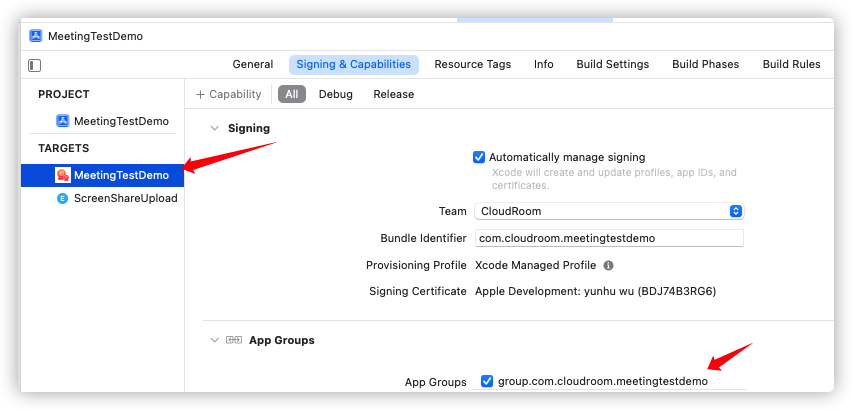

# 屏幕共享

## 功能介绍

在视频会话中为了提高沟通效率，可以将自己的屏幕内容分享给其他参与方观看。还支持在屏幕上进行标注，以及授权其他参与方进行远程控制。当屏幕共享者开启标注后，控件就进入标注模式。此时，房间内所有用户都可以进行标注，并观看他人标注的内容。
使用场景如下：
* 视频会议场景中，屏幕共享可以将讲话者本地的文件、数据、网页、PPT 等画面分享给其他与会人；
* 在线课堂场景中，屏幕共享可以将老师的课件、笔记、讲课内容等画面展示给学生观看。

:::danger

注意：同一个房间中，不支持多人同时开启屏幕共享。

:::

## 共享端

<h3 id=initShareScreenUI >1.创建屏幕共享观看组件</h3>

<font size = 3> 使用可视化UI组件进行屏幕共享显示和操作 </font>

+ 控件调用

```  oc
    //初始化控件,设置frame值
    CLShareView* shareView = [[CLShareView alloc]init];
    shareView.frame = self.view.bounds;
```

相关API请参考：
- [CLShareView](UIComponent.md#CLShareView)


<h3 id=startshare>2.开始共享</h3>

注意：设备系统在iOS12.0以上才支持本功能

- 准备工作：

创建屏幕录制子进程，进程名字为ScreenShareUpload


在屏幕录制子进程中引用CloudroomReplayKitExt.framework库，SampleHandler中添加调用SDK接口
```oc

- (void)broadcastStartedWithSetupInfo:(NSDictionary<NSString *,NSObject *> *)setupInfo {
    // User has requested to start the broadcast. Setup info from the UI extension can be supplied but optional.
    [[CRReplayKitExt shareInstance] broadcastStarted:self setupInfo:setupInfo];
}

- (void)broadcastPaused {
    // User has requested to pause the broadcast. Samples will stop being delivered.
    [[CRReplayKitExt shareInstance] broadcastPaused];
}

- (void)broadcastResumed {
    // User has requested to resume the broadcast. Samples delivery will resume.
    [[CRReplayKitExt shareInstance] broadcastResumed];
}

- (void)broadcastFinished {
    // User has requested to finish the broadcast.
    [[CRReplayKitExt shareInstance] broadcastFinished];
}

- (void)processSampleBuffer:(CMSampleBufferRef)sampleBuffer withType:(RPSampleBufferType)sampleBufferType {
    [[CRReplayKitExt shareInstance] processSampleBuffer:sampleBuffer withType:sampleBufferType];
}
```

添加APP Group，名字为：group.+主进程BundleIdentifier

屏幕录制子进程


App主进程


- 接口调用：

```oc

//设置屏幕共享参数:帧率8，其他采用系統默认參數
ScreenShareCfg *cfg = [[ScreenShareCfg alloc] init];
cfg.maxFPS = 8;
// 配置共享参数
[[CloudroomVideoMeeting shareInstance] setScreenShareCfg:cfg];
//开启屏幕共享
[[CloudroomVideoMeeting shareInstance] startScreenShare];
```

- 回调通知：

```oc

// 开启结果
-(void)startScreenShareRslt:(CRVIDEOSDK_ERR_DEF)sdkErr
{
    if(sdkErr == CRVIDEOSDK_NOERR)
    {
      //开启成功
    }
}

```

相关API请参考：
* [setScreenShareCfg](Apis.md#setScreenShareCfg)
* [startScreenShare](Apis.md#startScreenShare)
* [startScreenShareRslt](Apis.md#startScreenShareRslt)
* [notifyScreenShareStarted](Apis.md#notifyScreenShareStarted)


 <h3 id=startmark>3.开启标注</h3>

:::danger

注意：只有主动开启屏幕共享的用户，才可以开启标注功能。

:::

- 接口调用：

```oc
//开启标注
[[CloudroomVideoMeeting shareInstance] startScreenMark];
```
- 回调通知：

```oc

//开启标注结果
-(void)startScreenShareRslt:(CRVIDEOSDK_ERR_DEF)sdkErr{
  if(sdkErr == CRVIDEOSDK_NOERR)
  {
     
  }else{

  }
}

```


相关API请参考：
* [startScreenMark](Apis.md#startScreenMark)


<h3 id=stopmark>4.停止标注</h3>


- 接口调用：

```oc
//停止标注
[[CloudroomVideoMeeting shareInstance] stopScreenMark];

```
- 回调通知：

```oc
//停止标注的结果
-(void)stopScreenMarkRslt:(CRVIDEOSDK_ERR_DEF)sdkErr{
  //停止标注成功
  ...
}

```

相关API请参考：
* [stopScreenMark](Apis.md#stopScreenMark)


<h3 id=stopshare>5.停止共享</h3>

- 接口调用：

```oc
//主动停止屏幕共享
[[CloudroomVideoMeeting shareInstance] stopScreenShare];
```

- 回调通知：

```oc

//主动停止屏幕共享的结果
-(void)stopScreenShareRslt:(CRVIDEOSDK_ERR_DEF)sdkErr{
      ...
}

```

## 观看端


<h3 id=initShareScreenUI >1.创建屏幕共享观看组件</h3>

<font size = 3> 使用可视化UI组件进行屏幕共享显示和操作 </font>

+ 控件调用

```  oc
    //初始化控件,设置frame值
    CLShareView* shareView = [[CLShareView alloc]init];
    shareView.frame = self.view.bounds;
```

相关API请参考：
- [CLShareView](UIComponent.md#CLShareView)

<h3 id=startshareNotify>2.通知开始共享</h3>

+ 回调通知：

```oc

//收到屏幕共享通知的处理，显示屏幕共享控件
- (void)notifyScreenShareStarted{

}

```

相关API请参考：
 * [notifyScreenShareStarted](Apis.md#notifyScreenShareStarted)


<h3 id=startmarkNotify>3.通知开启标注</h3>

+ 回调通知：

```oc

//收到屏幕共享已开启标注的通知
- (void)notifyScreenMarkStarted {
  ...
}

```


<h3 id=stopmarkNotify>4.通知停止标注</h3>

+ 回调通知：

```oc

//收到屏幕共享停止标注的通知
- (void)notifyScreenMarkStopped{
  ...
}

```


<h3 id=stopshareNotify>5.通知停止共享</h3>

```oc

//收到他人停止了屏幕共享的通知
- (void)notifyScreenShareStopped
{
}
```


相关API请参考：
 * [notifyScreenShareStopped](Apis.md#notifyScreenShareStopped)
