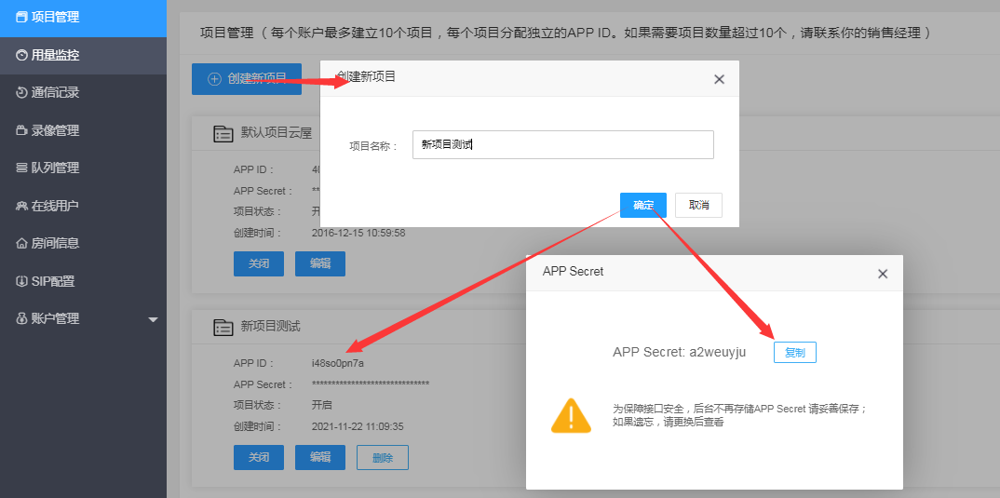

## 帐号申请

[点此注册](https://sdk.cloudroom.com/mgr_sdk/register.html) 一个账号，或者联系商务代为开通，或在网站咨询客服。

<h2 id=getappid>创建项目</h2>


可以在 [管理平台](https://sdk.cloudroom.com/mgr_sdk/) 中创建新的项目（系统有一个默认项目，可以直接使用），如下图：


为了保障接口安全，后台不再显示App Secret，所以请在创建项目成功显示App Secret时妥善保存好。 如果遗忘只能如下图更换App Secret：


<h2 id=fireWallSettings>防火墙开通</h2>

在使用云屋SDK提供的相关服务之前，您需要打开下面这些特定的端口：

<table border=0 cellpadding=0 cellspacing=0 style='border-collapse:collapse;table-layout:fixed;'>
    <thead>
        <tr >
            <th style='width:12%;text-align:center'>端口</th>
            <th style='width:25%;text-align:center'>功能说明</th>
            <th style='width:23%;text-align:center'>Windows, Linux, Android, iOS, macOS, 网页插件</th>
            <th style='width:10%;text-align:center'>H5 SDK</th>
            <th style='width:10%;text-align:center'>小程序SDK</th>
            <th style='width:10%;text-align:center'>直播观看SDK</th>
            <th style='width:10%;text-align:center'>后台管理页面</th>
        </tr>
    </thead>
    <tbody>
    <tr>
        <td>TCP 2725</td>
        <td style='text-align:center'>后台管理服务端口</td>
        <td></td>
        <td></td>
        <td></td>
        <td></td>
        <td style='text-align:center'>√</td>
    </tr>
    <tr>
        <td>TCP 2726</td>
        <td style='text-align:center'>https服务端口<br />(SDK缺省使用https)
        </td>
        <td style='text-align:center'>√</td>
        <td style='text-align:center'>√</td>
        <td style='text-align:center'>√</td>
        <td style='text-align:center'>√</td>
        <td style='text-align:center'></td>
    </tr>
    <tr>
        <td>TCP 2728</td>
        <td style='text-align:center'>信令服务端口</td>
        <td style='text-align:center'>√</td>
        <td style='text-align:center'></td>
        <td style='text-align:center'></td>
        <td style='text-align:center'></td>
        <td style='text-align:center'></td>
    </tr>
    <tr>
        <td>TCP 1935</td>
        <td style='text-align:center'>直播观看端口</td>
        <td></td>
        <td></td>
        <td style='text-align:center'>√</td>
        <td style='text-align:center'>√</td>
        <td style='text-align:center'></td>
    </tr>
    <tr>
        <td>UDP 2698</td>
        <td style='text-align:center'>服务器音视频流端口</td>
        <td style='text-align:center'>√</td>
        <td></td>
        <td></td>
        <td></td>
        <td></td>
    </tr>
    <tr>
        <td>UDP 2699</td>
        <td style='text-align:center'>服务器音视频流端口(H5)</td>
        <td></td>
        <td style='text-align:center'>√</td>
        <td></td>
        <td></td>
        <td></td>
    </tr>    
    </tbody>
</table>

## SDK导入及集成注意事项

注意： 以Android Stuido作为集成SDK实例工具， 集成流程如下：

1. 创建一个Android项目


2. 找到解压后的SDK根目录中，找到libs文件夹，将其拷贝到工程项目的app/libs目录中。


3. 在app目录下的build.gradle文件中android块中配置相关的sourceSets标签，如果没有使用该标签则新增,代码如下

```java
sourceSets {
    main {
        jniLibs.srcDirs = ['libs']
    }
}
```
4. 添加权限声明到AndroidManifest.xml文件

```xml
<uses-permission android:name="android.permission.INTERNET" />
<uses-permission android:name="android.permission.WRITE_EXTERNAL_STORAGE" />
```
5. 添加动态权限
* 开发环境中设置的compileSdkVersion高于23（Android6.0）以上时，请注意添加内部存储空间的动态权限