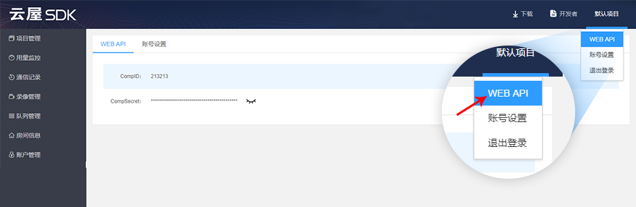

# 说明

## 使用条件

1、注册云屋科技账号

2、账户开通API权限

## API域名

https://www.cloudroom.com

## 公共参数 ${#common_param}

<table>
    <thead>
        <tr>
            <th style="width:100px;font-weight:700;text-align: left;">名称</th>
            <th  colspan="2" style="width:800px; text-align: left;">类型</th>
            <th  colspan="2" style="width:800px; text-align: left;">是否必传</th>
            <th  colspan="2" style="width:800px; text-align: left;">说明</th>
        </tr>
    </thead>
    <tbody>
        <tr>
            <td style="font-weight:normal;">RequestId</td>
            <td  colspan="2" style="font-weight:normal;">String</td>
            <td  colspan="2" style="font-weight:normal;">是</td>
            <td  colspan="2" style="font-weight:normal;">每次请求API的ID，可用UUID</td>
        </tr>
        <tr>
            <td style="font-weight:normal;">CompID</td>
            <td  colspan="2" style="font-weight:normal;">int</td>
            <td  colspan="2" style="font-weight:normal;">是</td>
            <td  colspan="2" style="font-weight:normal;">在云屋科技后台【WEB API】获取</td>
        </tr>
        <tr>
            <td style="font-weight:normal;">SecretKey</td>
            <td  colspan="2" style="font-weight:normal;">String</td>
            <td  colspan="2" style="font-weight:normal;">是</td>
            <td  colspan="2" style="font-weight:normal;">根据一定的规则生成的认证串</td>
        </tr>
        <tr>
            <td style="font-weight:normal;">AppId</td>
            <td  colspan="2" style="font-weight:normal;">String</td>
            <td  colspan="2" style="font-weight:normal;">否</td>
            <td  colspan="2" style="font-weight:normal;">项目id，可在管理后台，【项目管理】项获取</td>
        </tr>
    </tbody>   
</table>

SecretKey生成

SecretKey=MD5(CompID+'&'+CompSecret)

SecretKey由企业CompID和企业密钥CompSecret经过MD5加密生成的32位小写认证串

企业CompID和企业密钥CompSecret可以登录云屋科技管理后台，在【WEB API】处获取

注：自建版本用户的企业CompID和企业密钥CompSecret默认为1

## 返回数据

<table>
    <thead>
        <tr>
            <th style="width:100px;font-weight:700;text-align: left;">名称</th>
            <th  colspan="2" style="width:800px; text-align: left;">类型</th>
            <th  colspan="2" style="width:800px; text-align: left;">说明</th>
        </tr>
    </thead>
    <tbody>
        <tr>
            <td style="font-weight:normal;">RspCode</td>
            <td  colspan="2" style="font-weight:normal;">String</td>
            <td  colspan="2" style="font-weight:normal;">响应码</td>
        </tr>
        <tr>
            <td style="font-weight:normal;">RspDesc</td>
            <td  colspan="2" style="font-weight:normal;">string</td>
            <td  colspan="2" style="font-weight:normal;">响应描述</td>
        </tr>
        <tr>
            <td style="font-weight:normal;">Data</td>
            <td  colspan="2" style="font-weight:normal;">map</td>
            <td  colspan="2" style="font-weight:normal;">数据集合</td>
        </tr>
    </tbody>   
</table>

## 状态码说明

<table>
    <thead>
        <tr>
            <th style="width:100px;font-weight:700;text-align: left;">数值</th>
            <th  colspan="2" style="width:800px; text-align: left;">说明</th>
        </tr>
    </thead>
    <tbody>
        <tr>
            <td style="font-weight:normal;">0</td>
            <td  colspan="2" style="font-weight:normal;">请求成功</td>
        </tr>
        <tr>
            <td style="font-weight:normal;">其他数值</td>
            <td  colspan="2" style="font-weight:normal;">错误描述</td>
        </tr>
    </tbody>   
</table>

